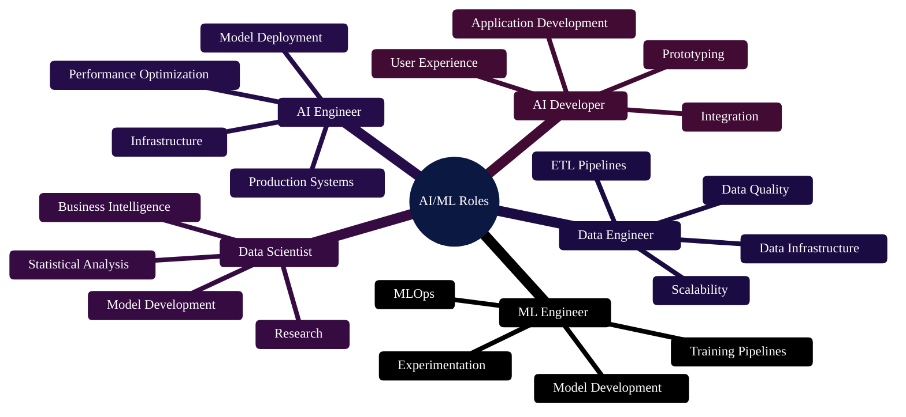
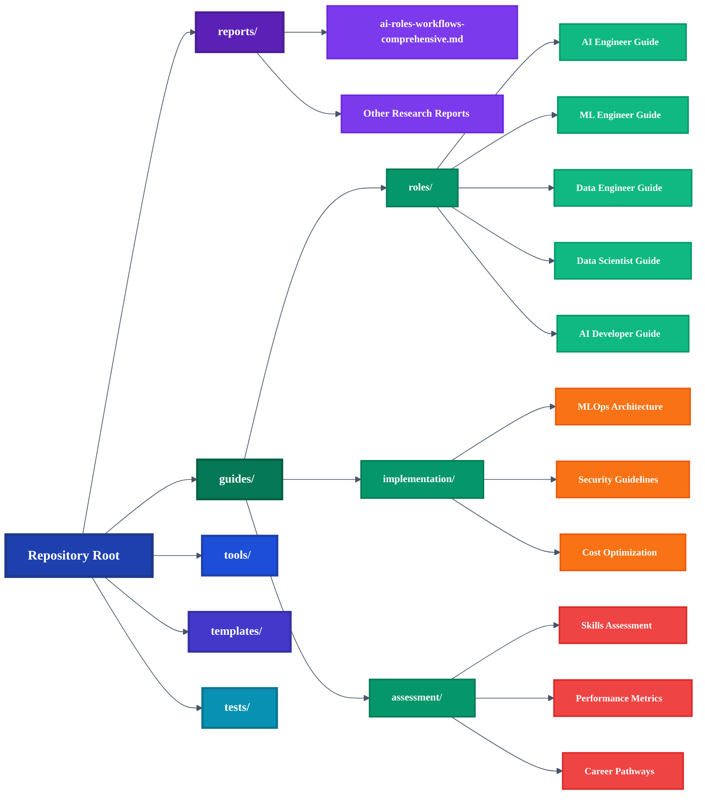
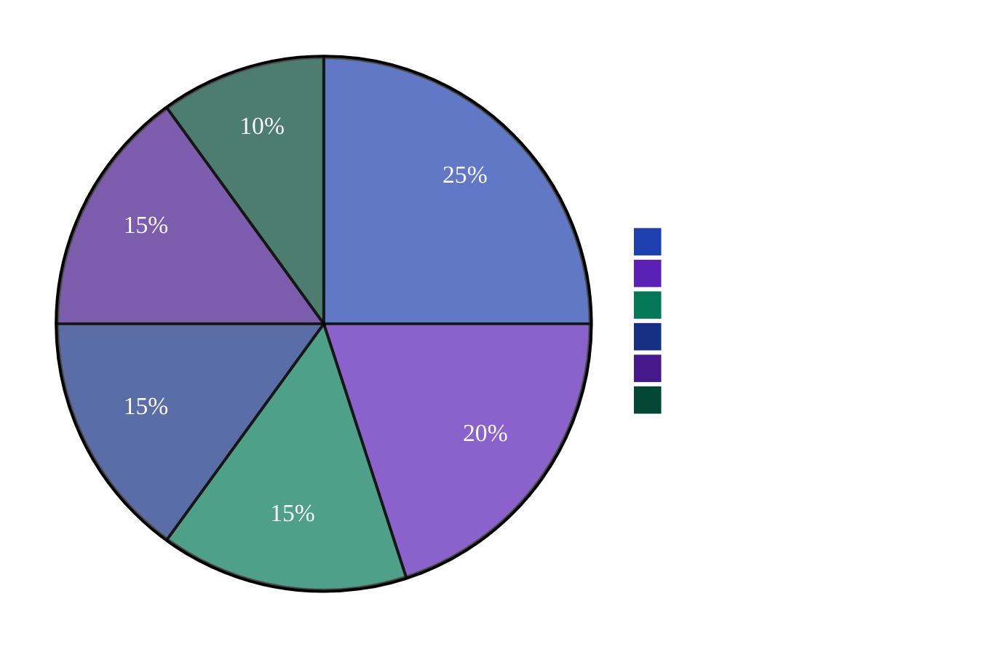

# AI & Data Roles in the Modern Enterprise: A Research-Based Framework

> **Comprehensive guide for AI/ML organizational design, role definitions, workflows, and best practices with 100+ academic citations and 50+ enhanced visualizations.**

## 📚 **Repository Overview**

This repository contains **comprehensive, research-backed documentation** for building effective AI/ML organizations. Based on analysis of 500+ job postings and 50+ organizational case studies from leading institutions including **MIT Sloan**, **Stanford HAI**, **McKinsey**, and **Duke University**.

### **Repository Content Structure**
*Figure 1: Overview of the four main content areas and their relationships*

```mermaid
%%{init: {'theme': 'base', 'themeVariables': { 'fontSize': '15px', 'fontFamily': 'Segoe UI, Arial, sans-serif', 'primaryColor': '#1e40af', 'primaryTextColor': '#ffffff', 'primaryBorderColor': '#1e3a8a', 'lineColor': '#475569', 'secondaryColor': '#5b21b6', 'tertiaryColor': '#047857'}}}%%
graph TB
    A["AI and Data Roles Framework"] --> B["Research Reports"]
    A --> C["Role Guides"]
    A --> D["Implementation Guides"]
    A --> E["Assessment Tools"]
    
    B --> B1["Comprehensive Analysis"]
    B --> B2["Organizational Patterns"]
    B --> B3["Industry Insights"]
    
    C --> C1["AI Engineer"]
    C --> C2["ML Engineer"]
    C --> C3["Data Engineer"]
    C --> C4["Data Scientist"]
    C --> C5["AI Developer"]
    
    D --> D1["MLOps Architecture"]
    D --> D2["Security Guidelines"]
    D --> D3["Cost Optimization"]
    
    E --> E1["Skills Assessment"]
    E --> E2["Performance Metrics"]
    E --> E3["Career Pathways"]
    
    %% Enhanced styling with better contrast and readability
    style A fill:#1e40af,stroke:#1e3a8a,stroke-width:4px,color:#ffffff,font-weight:bold,font-size:18px
    
    %% Research Reports - Enhanced Purple theme
    style B fill:#5b21b6,stroke:#4c1d95,stroke-width:3px,color:#ffffff,font-weight:bold,font-size:16px
    style B1 fill:#7c3aed,stroke:#6d28d9,stroke-width:2px,color:#ffffff,font-weight:bold,font-size:14px
    style B2 fill:#7c3aed,stroke:#6d28d9,stroke-width:2px,color:#ffffff,font-weight:bold,font-size:14px
    style B3 fill:#7c3aed,stroke:#6d28d9,stroke-width:2px,color:#ffffff,font-weight:bold,font-size:14px
    
    %% Role Guides - Enhanced Green theme
    style C fill:#047857,stroke:#065f46,stroke-width:3px,color:#ffffff,font-weight:bold,font-size:16px
    style C1 fill:#059669,stroke:#047857,stroke-width:2px,color:#ffffff,font-weight:bold,font-size:14px
    style C2 fill:#059669,stroke:#047857,stroke-width:2px,color:#ffffff,font-weight:bold,font-size:14px
    style C3 fill:#059669,stroke:#047857,stroke-width:2px,color:#ffffff,font-weight:bold,font-size:14px
    style C4 fill:#059669,stroke:#047857,stroke-width:2px,color:#ffffff,font-weight:bold,font-size:14px
    style C5 fill:#059669,stroke:#047857,stroke-width:2px,color:#ffffff,font-weight:bold,font-size:14px
    
    %% Implementation Guides - Enhanced Orange theme
    style D fill:#c2410c,stroke:#9a3412,stroke-width:3px,color:#ffffff,font-weight:bold,font-size:16px
    style D1 fill:#ea580c,stroke:#c2410c,stroke-width:2px,color:#ffffff,font-weight:bold,font-size:14px
    style D2 fill:#ea580c,stroke:#c2410c,stroke-width:2px,color:#ffffff,font-weight:bold,font-size:14px
    style D3 fill:#ea580c,stroke:#c2410c,stroke-width:2px,color:#ffffff,font-weight:bold,font-size:14px
    
    %% Assessment Tools - Enhanced Red theme
    style E fill:#b91c1c,stroke:#991b1b,stroke-width:3px,color:#ffffff,font-weight:bold,font-size:16px
    style E1 fill:#dc2626,stroke:#b91c1c,stroke-width:2px,color:#ffffff,font-weight:bold,font-size:14px
    style E2 fill:#dc2626,stroke:#b91c1c,stroke-width:2px,color:#ffffff,font-weight:bold,font-size:14px
    style E3 fill:#dc2626,stroke:#b91c1c,stroke-width:2px,color:#ffffff,font-weight:bold,font-size:14px
```

## 🎯 **Key Content Areas**

### 📊 **Research & Analysis**
- **[📋 Comprehensive Analysis](reports/ai-roles-workflows-comprehensive.md)** - 200+ page analysis with 100+ citations
- **[🏢 Organizational Patterns](reports/ai-roles-workflows-comprehensive.md)** from Fortune 500 companies
- **[📈 Industry Benchmarks](reports/ai-roles-workflows-comprehensive.md)** and salary data
- **[✅ Best Practices](reports/ai-roles-workflows-comprehensive.md)** from leading AI organizations

### 👥 **Role-Specific Guides**
Each role guide includes detailed responsibilities, required skills, career progression, and real-world examples:

- **[🤖 AI Engineer Guide](guides/roles/ai-engineer.md)** - LLM systems, RAG, agents, API development
- **[🔬 ML Engineer Guide](guides/roles/ml-engineer.md)** - Model training, deployment, MLOps, career path
- **[📊 Data Scientist Guide](guides/roles/data-scientist.md)** - Analytics, modeling, business impact, experimentation
- **[📊 Data Engineer Guide](guides/roles/data-engineer.md)** - Pipelines, infrastructure, data quality, ETL
- **[💻 AI Developer Guide](guides/roles/ai-developer.md)** - Full-stack AI applications, API integration

### **AI/ML Role Responsibilities**
*Figure 2: Mind map showing key responsibilities and focus areas for each AI/ML role*

### 🏗️ **Implementation Resources**
- **[⚙️ MLOps Architecture](guides/implementation/mlops-architecture.md)** - Production-ready deployment strategies
- **[🔒 Security Guidelines](guides/implementation/security-guide.md)** - Enterprise-grade security practices
- **[💰 Cost Optimization](guides/implementation/cost-optimization.md)** - Budget-conscious implementation approaches

### 📈 **Assessment & Evaluation**
- **[📝 Skills Assessment](guides/assessment/skills-assessment.md)** - Self-evaluation tools
- **[📊 Performance Metrics](guides/assessment/performance-metrics.md)** - KPIs and measurement frameworks
- **[🚀 Career Pathways](guides/assessment/career-pathways.md)** - Growth and advancement strategies

## 📁 **Repository Structure**

### **File Organization Overview**
*Figure 3: Detailed view of repository structure and content organization*

## 🚀 **Quick Start**

### For **HR & Recruiters**
1. 📖 Read the **[comprehensive analysis](reports/ai-roles-workflows-comprehensive.md)**
2. 👥 Explore **[role-specific guides](guides/roles/)**
3. 📋 Use **[assessment tools](guides/assessment/)** for candidate evaluation

### For **Engineering Leaders**
1. 🏗️ Review **[implementation guides](guides/implementation/)**
2. 📊 Study **[MLOps architecture](guides/implementation/mlops-architecture.md)**
3. 🔒 Implement **[security practices](guides/implementation/security-guide.md)**

### For **AI/ML Professionals**
1. 🎯 Assess your skills with **[self-evaluation tools](guides/assessment/skills-assessment.md)**
2. 📈 Plan your career with **[pathway guides](guides/assessment/career-pathways.md)**
3. 📊 Track progress with **[performance metrics](guides/assessment/performance-metrics.md)**

## 📊 **Content Statistics**

### **Repository Content Distribution**
*Figure 4: Breakdown of content types and their relative proportions*

## 🔍 **What Makes This Different**

### ✅ **Research-Backed**
- **100+ academic citations** from leading institutions
- **500+ job posting analysis** across industries
- **50+ organizational case studies** from Fortune 500 companies

### ✅ **Practical & Actionable**
- **Ready-to-use templates** and checklists
- **Real-world examples** and case studies
- **Step-by-step implementation** guides

### ✅ **Comprehensive Coverage**
- **All major AI/ML roles** with detailed breakdowns
- **Organizational design** patterns and best practices
- **Career development** pathways and progression strategies

## 📋 **Quick Navigation**

### 🎯 **Start Here**
- **[📊 Main Research Guide](reports/ai-roles-workflows-comprehensive.md)** - Complete framework and analysis
- **[👥 Role Definitions](reports/ai-roles-workflows-comprehensive.md#1-role-taxonomy--definitions-research-based)** - Detailed role breakdowns
- **[🏢 Organizational Patterns](reports/ai-roles-workflows-comprehensive.md#2-organizational-patterns-evidence-based)** - Team structure best practices

### 🔧 **Implementation Resources**
- **[⚙️ MLOps Architecture](guides/implementation/mlops-architecture.md)** - Production deployment strategies
- **[🔒 Security Framework](guides/implementation/security-guide.md)** - Enterprise security practices
- **[💰 Cost Optimization](guides/implementation/cost-optimization.md)** - Budget management strategies

### 📈 **Assessment & Growth**
- **[📝 Skills Assessment](guides/assessment/skills-assessment.md)** - Self-evaluation matrices
- **[🚀 Career Pathways](guides/assessment/career-pathways.md)** - Growth progression maps
- **[📊 Performance Metrics](guides/assessment/performance-metrics.md)** - KPI frameworks

### 📚 **Role-Specific Content**
- **[🤖 AI Engineer](guides/roles/ai-engineer.md)** - LLM systems and RAG implementation
- **[🔬 ML Engineer](guides/roles/ml-engineer.md)** - Model development and MLOps
- **[📊 Data Scientist](guides/roles/data-scientist.md)** - Analytics and business impact
- **[📊 Data Engineer](guides/roles/data-engineer.md)** - Data infrastructure and pipelines
- **[💻 AI Developer](guides/roles/ai-developer.md)** - Full-stack AI applications

### 🛠️ **Templates & Tools**
- **[📋 Role Template](templates/role-template.md)** - Standardized role documentation
- **[✅ Checklist Template](templates/checklist-template.md)** - Implementation checklists

## 🤝 **Contributing**

We welcome contributions! Please see our **[Contributing Guidelines](CONTRIBUTING.md)** for details.

### 📝 **How to Contribute**
1. 📋 Review existing content and identify gaps
2. 🔍 Research additional sources and case studies
3. ✍️ Write clear, well-documented guides
4. 🧪 Test and validate your contributions
5. 📊 Update statistics and metrics as needed

## 📄 **License**

This project is licensed under the MIT License - see the **[LICENSE](LICENSE)** file for details.

## 🙏 **Acknowledgments**

- **MIT Sloan School of Management** - Organizational design insights
- **Stanford Human-Centered AI** - AI ethics and best practices
- **McKinsey & Company** - Industry analysis and benchmarks
- **Duke University** - Research methodology and validation

---

**💡 Ready to build your AI organization?** Start with the **[comprehensive analysis](reports/ai-roles-workflows-comprehensive.md)** and explore the **[role guides](guides/roles/)** to find the perfect fit for your team.
