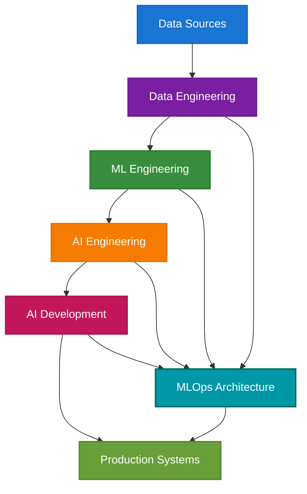
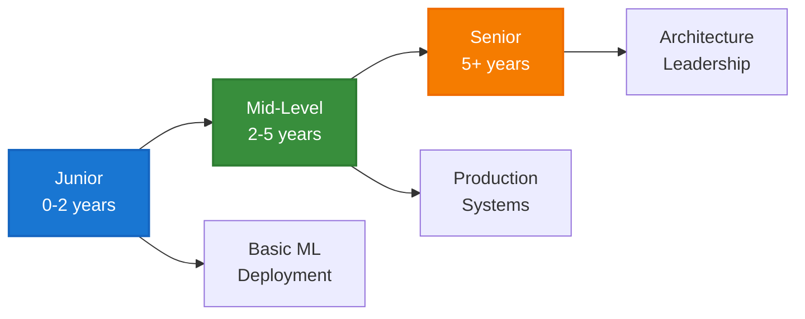

# ML Engineer Resources: Comprehensive Guide Collection

This repository contains a comprehensive collection of resources focused on Machine Learning Engineering in enterprise environments. Each document provides detailed insights, practical guidance, and industry best practices for ML Engineers at different career stages.

## 📚 Document Collection

### Core Role Documents

#### 1. **ML Engineer Enterprise Guide** (`ml_engineer_enterprise.md`)
- **Purpose**: Comprehensive overview of the ML Engineer role in enterprise settings
- **Content**: Role definition, responsibilities, skills, market trends, case studies
- **Audience**: Anyone interested in understanding the ML Engineer role
- **Key Features**:
  - Detailed skill requirements and salary trends
  - Real-world case studies (Netflix, Shopify, Stripe)
  - Future outlook and emerging trends
  - Interactive Mermaid diagrams

#### 2. **AI Engineer Deep Dive** (`ai_engineer_deepdive.md`)
- **Purpose**: Detailed exploration of AI Engineering vs ML Engineering
- **Content**: Role comparison, technical requirements, industry demand
- **Audience**: Professionals considering AI vs ML Engineering paths
- **Key Features**:
  - Clear distinction between AI and ML Engineering roles
  - Technology stack breakdown
  - Industry case studies and salary data

#### 3. **Data Engineer Enterprise Guide** (`data_engineer_enterprise.md`)
- **Purpose**: Understanding the Data Engineer role and its relationship to ML
- **Content**: Data pipeline design, warehousing, streaming, data quality
- **Audience**: ML Engineers working with data infrastructure
- **Key Features**:
  - Data infrastructure workflow diagrams
  - Modern data stack components
  - Real-world implementations (Airbnb, Shopify, DoorDash)

#### 4. **AI Developer Enterprise Guide** (`ai_developer_enterprise.md`)
- **Purpose**: Focus on AI application development and product integration
- **Content**: Application integration, prototyping, UX design, performance tuning
- **Audience**: Developers building AI-powered applications
- **Key Features**:
  - Product-focused AI development approach
  - Rapid prototyping methodologies
  - Case studies (Notion AI, Duolingo, GitHub Copilot)

### Practical Implementation Guides

#### 5. **MLOps Architecture Guide** (`mlops_architecture_guide.md`)
- **Purpose**: Comprehensive MLOps implementation guide
- **Content**: Architecture patterns, implementation examples, best practices
- **Audience**: ML Engineers implementing production ML systems
- **Key Features**:
  - Complete MLOps architecture components
  - Code examples for common patterns
  - Security, monitoring, and deployment strategies
  - Cost optimization techniques

#### 6. **ML Engineer Skills Assessment** (`ml_engineer_skills_assessment.md`)
- **Purpose**: Structured evaluation framework for ML Engineer skills
- **Content**: Assessment criteria, learning paths, evaluation metrics
- **Audience**: Hiring managers, career development, self-assessment
- **Key Features**:
  - Level-specific assessment criteria (Junior, Mid, Senior)
  - Practical coding challenges and examples
  - Learning paths and skill development guidance
  - Evaluation metrics and tools

## 🎯 Target Audience

### **For Job Seekers**
- Understand role requirements and career progression
- Identify skill gaps and development areas
- Prepare for technical interviews and assessments

### **For Hiring Managers**
- Define role requirements and expectations
- Create assessment frameworks and interview processes
- Understand market trends and compensation

### **For ML Engineers**
- Stay current with industry best practices
- Implement production-ready ML systems
- Develop advanced skills and career growth

### **For Organizations**
- Build effective ML teams and infrastructure
- Implement MLOps best practices
- Scale ML operations efficiently

## 🏗️ Architecture Overview

## 📊 Key Insights

### **Role Evolution**
- **Data Engineer**: Foundation layer - data pipelines and warehousing
- **ML Engineer**: Core ML lifecycle - training, deployment, monitoring
- **AI Engineer**: Advanced AI systems - infrastructure and optimization
- **AI Developer**: Application layer - product integration and UX

### **Skill Progression**

### **Technology Stack**
- **Programming**: Python, SQL, Scala, Java, JavaScript
- **ML Frameworks**: TensorFlow, PyTorch, Scikit-learn, XGBoost
- **MLOps**: MLflow, Kubeflow, Seldon, Airflow, Docker, Kubernetes
- **Cloud**: AWS SageMaker, Google Vertex AI, Azure ML
- **Monitoring**: Prometheus, Grafana, custom dashboards

## 🚀 Getting Started

### **For Beginners**
1. Start with `ml_engineer_enterprise.md` for role overview
2. Review `ml_engineer_skills_assessment.md` for skill requirements
3. Study `mlops_architecture_guide.md` for implementation patterns

### **For Experienced Professionals**
1. Focus on `mlops_architecture_guide.md` for advanced patterns
2. Review case studies in role-specific documents
3. Use skills assessment for career planning

### **For Organizations**
1. Review all role documents to understand team structure
2. Implement MLOps architecture guide for production systems
3. Use skills assessment for hiring and development

## 📈 Industry Trends

### **Salary Ranges (2024-2025)**
- **Junior ML Engineer**: $90,000 - $130,000
- **Mid-Level ML Engineer**: $130,000 - $180,000
- **Senior ML Engineer**: $180,000 - $250,000+
- **Principal/Staff ML Engineer**: $250,000 - $400,000+

### **High-Demand Sectors**
1. **Fintech**: Fraud detection, risk assessment, algorithmic trading
2. **Healthcare**: Medical imaging, drug discovery, patient care
3. **E-commerce**: Recommendation systems, demand forecasting
4. **Technology**: Cloud services, AI platforms, developer tools

### **Emerging Trends**
- Real-time ML and edge computing
- Multimodal AI systems (text, image, audio)
- Responsible AI and governance
- Large Language Models and generative AI

## 🔧 Technical Focus Areas

### **Core ML Skills**
- Model development and training
- Feature engineering and selection
- Model evaluation and validation
- Hyperparameter optimization

### **Production Skills**
- Model deployment and serving
- Performance monitoring and alerting
- Data drift detection and retraining
- Security and compliance

### **Infrastructure Skills**
- Container orchestration (Kubernetes)
- CI/CD for ML pipelines
- Cloud platform expertise
- Distributed systems design

## 📝 Contributing

This collection is designed to be a living resource. Contributions are welcome in the following areas:

- **Case Studies**: Real-world implementation examples
- **Technical Patterns**: New MLOps patterns and best practices
- **Tool Updates**: Latest technology and framework information
- **Industry Trends**: Updated market data and salary information

## 📚 Additional Resources

### **Recommended Reading**
- "Designing Machine Learning Systems" by Chip Huyen
- "Building Machine Learning Powered Applications" by Emmanuel Ameisen
- "MLOps Engineering at Scale" by Carl Osipov

### **Online Courses**
- Coursera: Machine Learning Engineering for Production (MLOps)
- Udacity: Machine Learning Engineer Nanodegree
- edX: Professional Certificate in Machine Learning

### **Communities**
- MLOps Community (Slack)
- DataTalks.Club
- Papers With Code
- Kaggle
