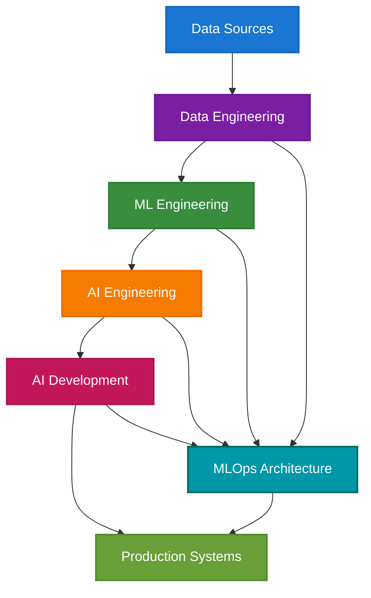
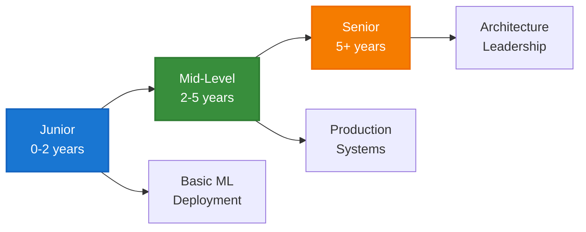

# ML Engineer Resources: Enterprise Guide Collection

> **Comprehensive resources for Machine Learning Engineering in enterprise environments**

---

## 📋 Quick Navigation

| **Role Guides** | **Implementation** | **Assessment** |
|-----------------|-------------------|----------------|
| [ML Engineer](ml_engineer_enterprise.md) | [MLOps Architecture](mlops_architecture_guide.md) | [Skills Assessment](ml_engineer_skills_assessment.md) |
| [AI Engineer](ai_engineer_deepdive.md) | | |
| [Data Engineer](data_engineer_enterprise.md) | | |
| [AI Developer](ai_developer_enterprise.md) | | |

---

## 🎯 Overview

This collection provides enterprise-focused guidance for ML Engineering roles, from foundational concepts to advanced implementation patterns. Each guide includes real-world case studies, technical architectures, and practical best practices.

### **Core Focus Areas**
- **Role Clarity**: Clear distinctions between ML, AI, and Data Engineering
- **Production Readiness**: MLOps patterns and deployment strategies  
- **Career Development**: Skill assessment and progression frameworks
- **Enterprise Integration**: Scalable architectures and team structures

---

## 🏗️ Architecture Overview

*This architecture shows the progression from data sources through various engineering roles to production systems, with MLOps as the foundational infrastructure.*

---

## 📚 Guide Collection

### **Role-Specific Guides**

#### [ML Engineer Enterprise Guide](ml_engineer_enterprise.md)
**Purpose**: Comprehensive overview of ML Engineering in enterprise settings  
**Key Content**: Role definition, lifecycle management, case studies (Netflix, Shopify, Stripe)  
**Best For**: Understanding the core ML Engineer role and responsibilities

#### [AI Engineer Deep Dive](ai_engineer_deepdive.md)  
**Purpose**: Advanced AI systems and infrastructure optimization  
**Key Content**: Model integration, deployment strategies, ethical governance  
**Best For**: AI infrastructure and production system design

#### [Data Engineer Enterprise Guide](data_engineer_enterprise.md)
**Purpose**: Data pipeline design and modern data stack implementation  
**Key Content**: ETL/ELT workflows, data warehousing, real-time processing  
**Best For**: Building scalable data infrastructure for ML systems

#### [AI Developer Enterprise Guide](ai_developer_enterprise.md)
**Purpose**: AI application development and product integration  
**Key Content**: Rapid prototyping, UX design, performance optimization  
**Best For**: Building AI-powered applications and features

### **Implementation Guides**

#### [MLOps Architecture Guide](mlops_architecture_guide.md)
**Purpose**: Production-ready ML system implementation  
**Key Content**: Architecture patterns, deployment strategies, monitoring  
**Best For**: Implementing enterprise MLOps infrastructure

#### [ML Engineer Skills Assessment](ml_engineer_skills_assessment.md)
**Purpose**: Structured evaluation and career development framework  
**Key Content**: Assessment criteria, learning paths, evaluation metrics  
**Best For**: Career planning and skill development

---

## 🚀 Getting Started

### **For Job Seekers**
1. **Start Here**: [ML Engineer Guide](ml_engineer_enterprise.md) for role overview
2. **Assess Skills**: [Skills Assessment](ml_engineer_skills_assessment.md) for gap analysis
3. **Learn Implementation**: [MLOps Guide](mlops_architecture_guide.md) for technical depth

### **For Hiring Managers**
1. **Understand Roles**: Review all role guides for team structure planning
2. **Assessment Framework**: Use [Skills Assessment](ml_engineer_skills_assessment.md) for hiring
3. **Implementation**: Reference [MLOps Guide](mlops_architecture_guide.md) for infrastructure

### **For Organizations**
1. **Team Planning**: Review role guides for organizational structure
2. **Infrastructure**: Implement [MLOps patterns](mlops_architecture_guide.md)
3. **Development**: Use [Skills Assessment](ml_engineer_skills_assessment.md) for growth

---

## 📊 Key Insights

### **Role Evolution**
- **Data Engineer**: Foundation layer - data pipelines and warehousing
- **ML Engineer**: Core ML lifecycle - training, deployment, monitoring  
- **AI Engineer**: Advanced AI systems - infrastructure and optimization
- **AI Developer**: Application layer - product integration and UX

### **Skill Progression**

### **Technology Stack**
- **Programming**: Python, SQL, Scala, Java, JavaScript
- **ML Frameworks**: TensorFlow, PyTorch, Scikit-learn, XGBoost
- **MLOps**: MLflow, Kubeflow, Seldon, Airflow, Docker, Kubernetes
- **Cloud**: AWS SageMaker, Google Vertex AI, Azure ML
- **Monitoring**: Prometheus, Grafana, custom dashboards

---

## 📈 Industry Context

### **Salary Ranges (2024-2025)**
- **Junior ML Engineer**: $90,000 - $130,000
- **Mid-Level ML Engineer**: $130,000 - $180,000  
- **Senior ML Engineer**: $180,000 - $250,000+
- **Principal/Staff ML Engineer**: $250,000 - $400,000+

### **High-Demand Sectors**
1. **Fintech**: Fraud detection, risk assessment, algorithmic trading
2. **Healthcare**: Medical imaging, drug discovery, patient care
3. **E-commerce**: Recommendation systems, demand forecasting
4. **Technology**: Cloud services, AI platforms, developer tools

---

## 📝 Contributing

This collection is designed as a living resource. Contributions are welcome in:

- **Case Studies**: Real-world implementation examples
- **Technical Patterns**: New MLOps patterns and best practices  
- **Tool Updates**: Latest technology and framework information
- **Industry Trends**: Updated market data and salary information

---

## 📚 Additional Resources

### **Recommended Reading**
- "Designing Machine Learning Systems" by Chip Huyen
- "Building Machine Learning Powered Applications" by Emmanuel Ameisen
- "MLOps Engineering at Scale" by Carl Osipov

### **Communities**
- MLOps Community (Slack)
- DataTalks.Club
- Papers With Code
- Kaggle
