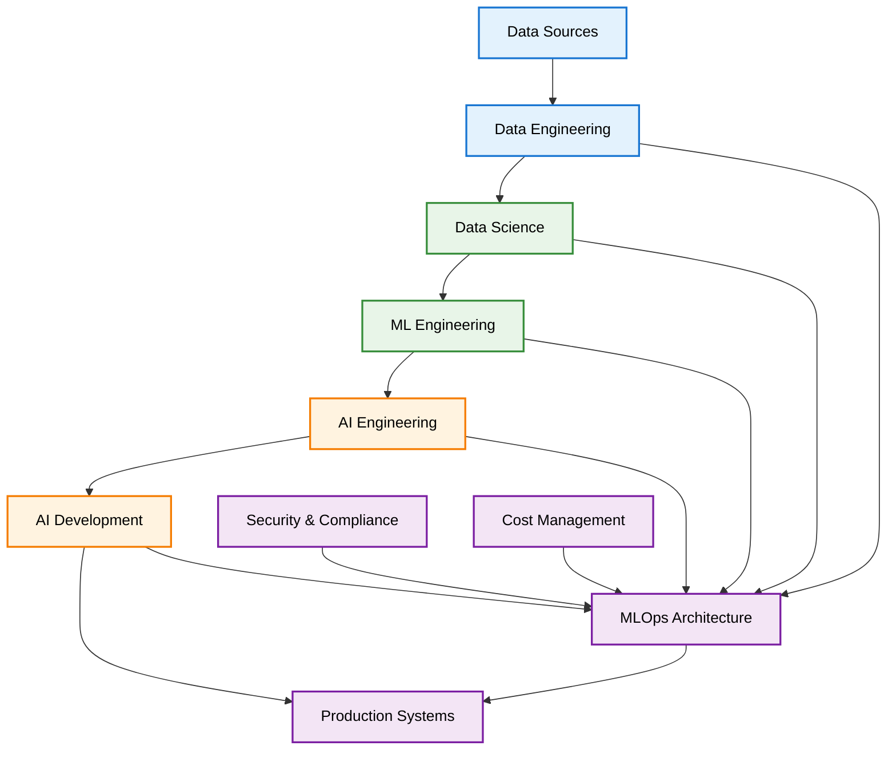

# AI & ML Engineering Enterprise Resource Hub

> **Comprehensive resources for AI/ML Engineering in enterprise environments**

---

## 🎯 Quick Start

| **For Role Understanding** | **For Implementation** | **For Assessment** |
|---------------------------|------------------------|-------------------|
| [📋 AI Roles & Workflows](reports/ai-roles-workflows-comprehensive.md) | [🏗️ MLOps Architecture](guides/implementation/mlops-architecture.md) | [📊 Skills Assessment](guides/assessment/skills-assessment.md) |
| [🔬 ML Engineer Guide](guides/roles/ml-engineer.md) | [🔒 Security Guide](guides/implementation/security-guide.md) | [📈 Performance Metrics](guides/assessment/performance-metrics.md) |
| [🤖 AI Engineer Guide](guides/roles/ai-engineer.md) | [💰 Cost Optimization](guides/implementation/cost-optimization.md) | [🎯 Career Pathways](guides/assessment/career-pathways.md) |

---

## 📚 Resource Collection

### **🎭 Role-Specific Guides**

#### [AI Engineer](guides/roles/ai-engineer.md)
**Purpose**: Advanced AI systems and infrastructure optimization  
**Key Content**: Model integration, deployment strategies, ethical governance  
**Best For**: AI infrastructure and production system design

#### [ML Engineer](guides/roles/ml-engineer.md)
**Purpose**: Comprehensive overview of ML Engineering in enterprise settings  
**Key Content**: Role definition, lifecycle management, case studies  
**Best For**: Understanding the core ML Engineer role and responsibilities

#### [Data Scientist](guides/roles/data-scientist.md)
**Purpose**: Analytical insights and business impact through data science  
**Key Content**: Statistical analysis, model development, insight communication  
**Best For**: Understanding analytical workflows and business impact measurement

#### [Data Engineer](guides/roles/data-engineer.md)
**Purpose**: Data pipeline design and modern data stack implementation  
**Key Content**: ETL/ELT workflows, data warehousing, real-time processing  
**Best For**: Building scalable data infrastructure for ML systems

#### [AI Developer](guides/roles/ai-developer.md)
**Purpose**: AI application development and product integration  
**Key Content**: Rapid prototyping, UX design, performance optimization  
**Best For**: Building AI-powered applications and features

### **🏗️ Implementation Guides**

#### [MLOps Architecture](guides/implementation/mlops-architecture.md)
**Purpose**: Production-ready ML system design and deployment  
**Key Content**: Architecture patterns, tooling, best practices  
**Best For**: Building scalable ML infrastructure

#### [Security Guide](guides/implementation/security-guide.md)
**Purpose**: AI/ML security best practices and compliance  
**Key Content**: Threat modeling, data protection, audit trails  
**Best For**: Securing AI systems in enterprise environments

#### [Cost Optimization](guides/implementation/cost-optimization.md)
**Purpose**: Managing AI/ML infrastructure costs effectively  
**Key Content**: Token economics, resource optimization, ROI tracking  
**Best For**: Optimizing AI system costs and budgets

### **📊 Assessment & Evaluation**

#### [Skills Assessment](guides/assessment/skills-assessment.md)
**Purpose**: Evaluate ML engineering skills and competencies  
**Key Content**: Assessment frameworks, skill matrices, evaluation criteria  
**Best For**: Hiring, career development, and skill gap analysis

### **📋 Comprehensive Resources**

#### [AI Roles & Workflows](reports/ai-roles-workflows-comprehensive.md)
**Purpose**: Complete overview of AI/ML roles and organizational patterns  
**Key Content**: Role taxonomy, workflows, KPIs, governance, hiring  
**Best For**: Understanding the complete AI/ML ecosystem

---

## 🏗️ Enterprise AI Architecture Overview

*Figure 1: Enterprise AI Architecture Flow. This architecture shows the progression from data sources through various analytical and engineering roles to production systems, with MLOps, security, and cost management as foundational infrastructure.*

---

## 🎯 Core Focus Areas

### **Role Clarity & Evolution**
- Clear distinctions between ML, AI, Data Science, and Data Engineering roles
- Role evolution patterns and career progression paths
- Skill requirements and competency frameworks

### **Production Readiness**
- MLOps patterns and deployment strategies
- Scalable architectures and infrastructure design
- Monitoring, observability, and reliability engineering

### **Enterprise Integration**
- Security, compliance, and governance frameworks
- Cost optimization and ROI measurement
- Team structures and organizational patterns

### **Implementation Excellence**
- Best practices and anti-patterns
- Tool selection and technology stack guidance
- Performance optimization and troubleshooting

---

## 🚀 Getting Started

### **For Organizations**
1. **Start with** [AI Roles & Workflows](reports/ai-roles-workflows-comprehensive.md) for organizational understanding
2. **Review** [MLOps Architecture](guides/implementation/mlops-architecture.md) for implementation strategy
3. **Assess** current capabilities using [Skills Assessment](guides/assessment/skills-assessment.md)

### **For Individual Contributors**
1. **Identify your role** using the [Role Guides](guides/roles/)
2. **Understand implementation** through [Implementation Guides](guides/implementation/)
3. **Evaluate your skills** with [Assessment Tools](guides/assessment/)

### **For Hiring Managers**
1. **Understand role requirements** from [Role Guides](guides/roles/)
2. **Design organizational structure** using [AI Roles & Workflows](reports/ai-roles-workflows-comprehensive.md)
3. **Assess candidates** with [Skills Assessment](guides/assessment/skills-assessment.md)

---

## 📈 Key Metrics & KPIs

| **Category** | **Metrics** | **Targets** |
|-------------|-------------|-------------|
| **Performance** | Model accuracy, latency, throughput | 95%+ accuracy, <100ms latency |
| **Reliability** | Uptime, error rates, MTTR | 99.9% uptime, <1% error rate |
| **Cost** | Cost per prediction, ROI | <$0.01 per prediction, 3x+ ROI |
| **Security** | Security incidents, compliance score | 0 incidents, 100% compliance |
| **Team** | Feature velocity, deployment frequency | Weekly deployments, 2x velocity |

---

## 🔄 Continuous Improvement

This resource hub is continuously updated with:
- **Latest industry trends** and best practices
- **New tools and technologies** in the AI/ML ecosystem
- **Real-world case studies** and implementation examples
- **Security and compliance** updates
- **Cost optimization** strategies

---

## 🤝 Contributing

We welcome contributions to improve these resources:
- **Content updates** and corrections
- **New role guides** or implementation patterns
- **Case studies** and real-world examples
- **Tool recommendations** and comparisons

---

## 📞 Support & Resources

- **Industry Reports**: Links to relevant research and industry reports
- **Tool Comparisons**: Detailed comparisons of AI/ML tools and platforms
- **Community Resources**: Links to relevant communities and forums
- **Training Programs**: Recommended training and certification programs

---

*Last Updated: December 2024 | Version: 2.0*
