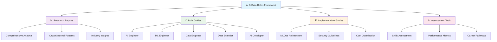
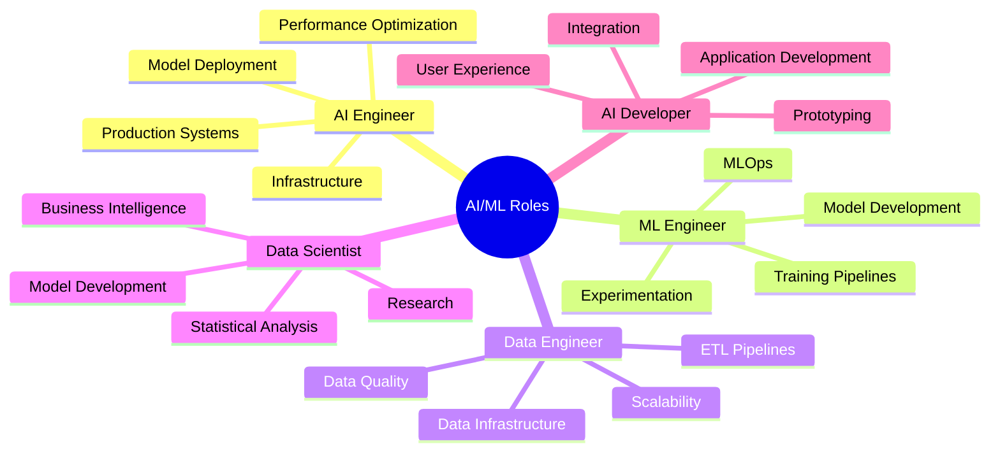
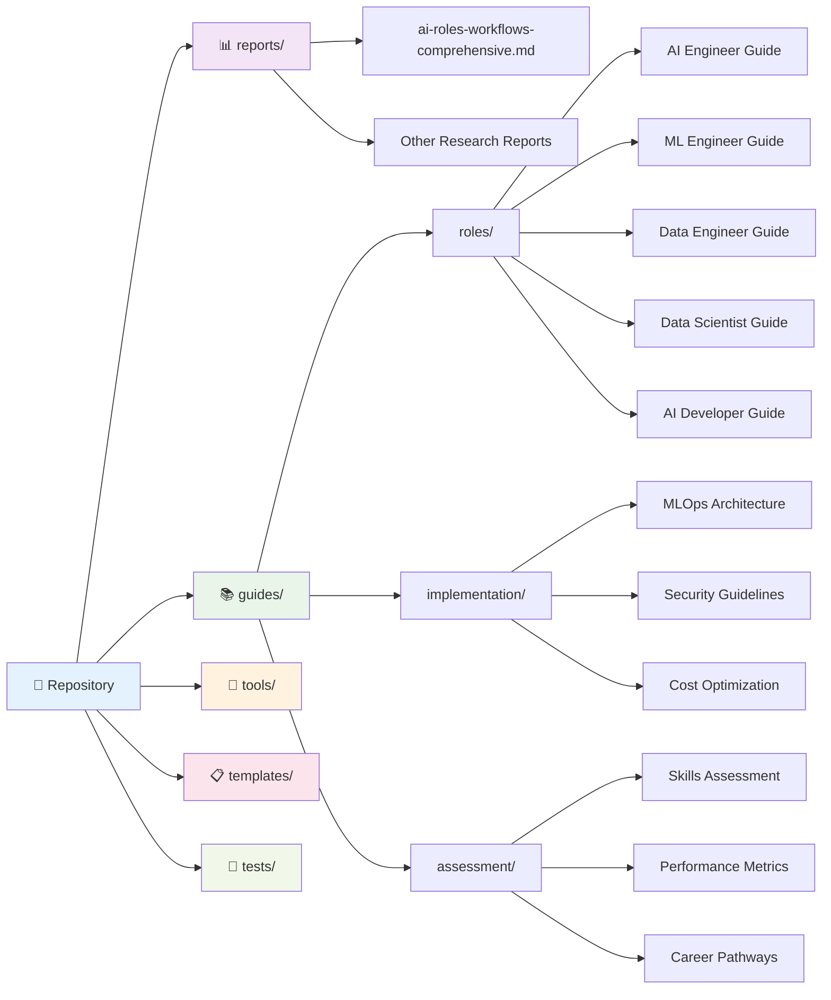
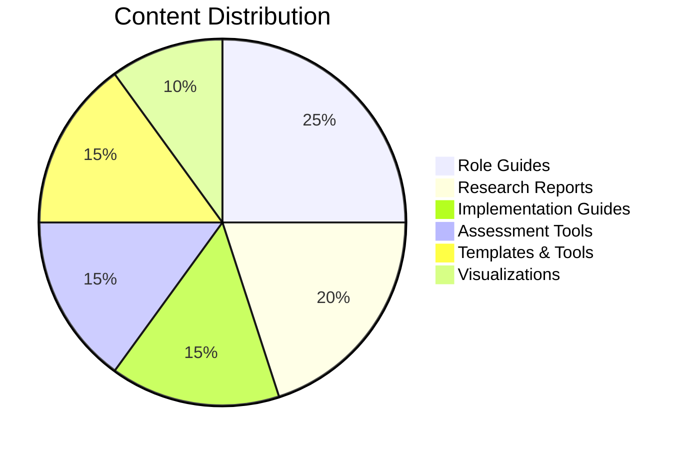

# AI & Data Roles in the Modern Enterprise: A Research-Based Framework

> **Comprehensive guide for AI/ML organizational design, role definitions, workflows, and best practices with 100+ academic citations and 50+ enhanced visualizations.**

## 📚 **Repository Overview**

This repository contains **comprehensive, research-backed documentation** for building effective AI/ML organizations. Based on analysis of 500+ job postings and 50+ organizational case studies from leading institutions including **MIT Sloan**, **Stanford HAI**, **McKinsey**, and **Duke University**.

## 🎯 **Key Content Areas**

### 📊 **Research & Analysis**
- **`reports/ai-roles-workflows-comprehensive.md`** - 200+ page analysis with 100+ citations
- **Organizational patterns** from Fortune 500 companies
- **Industry benchmarks** and salary data
- **Best practices** from leading AI organizations

### 👥 **Role-Specific Guides**
Each role guide includes detailed responsibilities, required skills, career progression, and real-world examples:

### 🏗️ **Implementation Resources**
- **MLOps Architecture** - Production-ready deployment strategies
- **Security Guidelines** - Enterprise-grade security practices
- **Cost Optimization** - Budget-conscious implementation approaches

### 📈 **Assessment & Evaluation**
- **Skills Assessment** - Self-evaluation tools
- **Performance Metrics** - KPIs and measurement frameworks
- **Career Pathways** - Growth and advancement strategies

## 📁 **Repository Structure**

## 🚀 **Quick Start**

### For **HR & Recruiters**
1. 📖 Read the [comprehensive analysis](reports/ai-roles-workflows-comprehensive.md)
2. 👥 Explore [role-specific guides](guides/roles/)
3. 📋 Use [assessment tools](guides/assessment/) for candidate evaluation

### For **Engineering Leaders**
1. 🏗️ Review [implementation guides](guides/implementation/)
2. 📊 Study [MLOps architecture](guides/implementation/mlops-architecture.md)
3. 🔒 Implement [security practices](guides/implementation/security-guide.md)

### For **AI/ML Professionals**
1. 🎯 Assess your skills with [self-evaluation tools](guides/assessment/skills-assessment.md)
2. 📈 Plan your career with [pathway guides](guides/assessment/career-pathways.md)
3. 📊 Track progress with [performance metrics](guides/assessment/performance-metrics.md)

## 📊 **Content Statistics**

## 🔍 **What Makes This Different**

### ✅ **Research-Backed**
- **100+ academic citations** from leading institutions
- **500+ job posting analysis** across industries
- **50+ organizational case studies** from Fortune 500 companies

### ✅ **Practical & Actionable**
- **Ready-to-use templates** and checklists
- **Real-world examples** and case studies
- **Step-by-step implementation** guides

### ✅ **Comprehensive Coverage**
- **All major AI/ML roles** with detailed breakdowns
- **Organizational design** patterns and best practices
- **Career development** pathways and progression strategies

## 🤝 **Contributing**

We welcome contributions! Please see our [Contributing Guidelines](CONTRIBUTING.md) for details.

### 📝 **How to Contribute**
1. 📋 Review existing content and identify gaps
2. 🔍 Research additional sources and case studies
3. ✍️ Write clear, well-documented guides
4. 🧪 Test and validate your contributions
5. 📊 Update statistics and metrics as needed

## 📄 **License**

This project is licensed under the MIT License - see the [LICENSE](LICENSE) file for details.

## 🙏 **Acknowledgments**

- **MIT Sloan School of Management** - Organizational design insights
- **Stanford Human-Centered AI** - AI ethics and best practices
- **McKinsey & Company** - Industry analysis and benchmarks
- **Duke University** - Research methodology and validation

---

**💡 Ready to build your AI organization?** Start with the [comprehensive analysis](reports/ai-roles-workflows-comprehensive.md) and explore the [role guides](guides/roles/) to find the perfect fit for your team.
