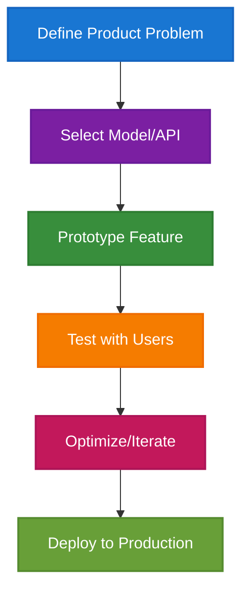
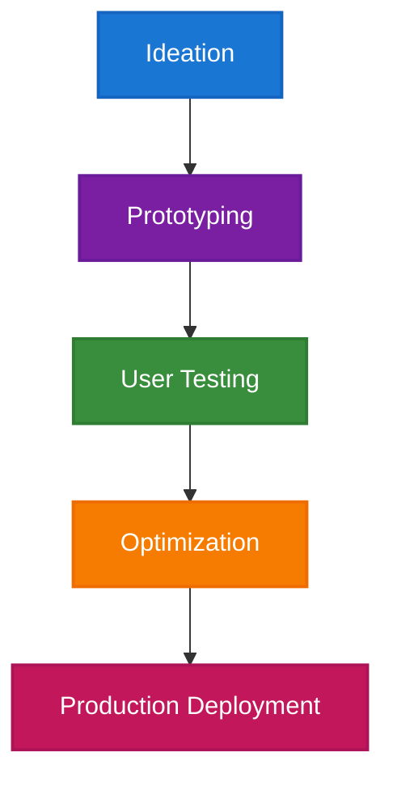
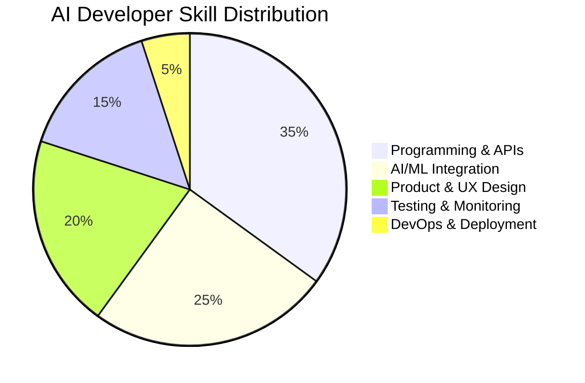

# The AI Developer in the Enterprise: Architecting Intelligence for the Real World

## Abstract

AI Developers are the creative force behind today's intelligent applications—translating the theories of AI into practical products that shape how we live, work, and connect. In this deep dive, we explore the evolution, responsibilities, key skills, challenges, and future of the AI Developer, with visual examples and real industry case studies.

---

## Introduction

If the 2010s were about proving that AI "works," the 2020s are about shipping AI products to millions. AI Developers are the builders at this new frontier. From voice assistants to AI-driven productivity tools, it's AI Developers who turn large language models and neural nets into features that users love (Forbes 2025). Their work is creative, iterative, and collaborative—sitting at the crossroads of coding, design, and product vision.

---

## Role Definition & Evolution

**AI Developers** differ from AI Engineers: developers are hands-on coders focused on building and iterating on AI-powered apps, tools, or platforms. While engineers often manage the infrastructure and deployment, developers implement the logic, interfaces, and integrations that make AI accessible (Mobilunity 2025). The rise of no-code/low-code AI, open-source models, and API-driven platforms has greatly expanded the AI Developer's reach.

---

## Core Responsibilities

1. **Application Integration**: Embedding AI models (e.g., OpenAI, Hugging Face, custom models) into web, mobile, and desktop apps via SDKs and APIs.
2. **Feature Prototyping**: Rapidly building and testing new AI features—like chatbots, recommendation engines, or image recognition—based on user feedback.
3. **UX & Interaction Design**: Creating interfaces that help users interact intuitively with AI (e.g., prompt design, context handling, fallback strategies).
4. **Performance Tuning**: Optimizing model calls for speed and cost, sometimes leveraging caching, batching, or hybrid (cloud + local) inference.
5. **Collaboration**: Working closely with designers, product managers, and sometimes researchers to bring ideas from concept to launch.

---

## Visual: Typical AI Developer Workflow

*This workflow diagram illustrates the agile, user-centered approach of AI Developers, from defining product problems to deploying production-ready features. Each stage is iterative, reflecting the rapid prototyping and feedback cycles essential to modern AI product development.*

---

## Visual: AI Developer Product Lifecycle

*This lifecycle diagram provides a high-level overview of the product journey for AI Developers, emphasizing the importance of iterative development, user feedback, and continuous improvement in delivering impactful AI-powered applications.*

---

## Skill Requirements

**Technical Skills**:
- Programming: Python, JavaScript/TypeScript (React, Node.js), and increasingly Swift/Kotlin for mobile AI apps.
- AI/ML APIs & SDKs: OpenAI, Hugging Face, TensorFlow.js, ONNX, LangChain.
- Dev Tools: GitHub Copilot, VS Code, cloud IDEs, REST/gRPC APIs.
- Prompt Engineering: Designing effective prompts for LLMs, including context control and retrieval-augmented generation (RAG).
- Testing & Monitoring: Unit tests, regression suites, A/B testing frameworks.

**Soft Skills**:
- Rapid Prototyping: Willingness to iterate, learn, and pivot based on feedback.
- Product Thinking: Balancing what's technically possible with what's valuable for users.
- Communication: Explaining complex AI behavior to non-technical stakeholders.

---

## Industry Demand & Market Trends

AI Developer roles have seen explosive growth, driven by the democratization of model access and the proliferation of generative AI tools (LinkedIn 2024). According to Indeed, the average AI Developer salary in the U.S. was $145,000 in 2024, with startups and product companies leading hiring (Indeed 2025). AI Developer communities are vibrant—GitHub reports over 200,000 active repos labeled "AI" in 2024.

---

## Visual: AI Developer Skill Stack Composition

*This breakdown shows the typical skill distribution for AI Developers, emphasizing the balance between technical implementation and product-focused development.*

---

## Challenges & Best Practices

- **API Costs**: Unoptimized model calls can quickly eat up budgets; batching and caching are musts (Forbes 2025).
- **Security & Privacy**: User data passed to models must be handled with care (GDPR, CCPA compliance).
- **Model Drift & Updates**: APIs and models change fast; automated testing and monitoring are critical to avoid breaking features (HBR 2024).
- **Prompt Instability**: Changes in underlying models can alter outputs—maintain prompt libraries and fallback logic.

---

## Case Studies

### 1. Notion AI

Notion's AI features—including content summarization and writing assistants—were rapidly prototyped and tested by small cross-functional AI Developer teams, accelerating product-market fit (Notion Blog 2024).

### 2. Duolingo

AI Developers integrated speech recognition models to personalize learning paths and provide instant feedback, boosting engagement and completion rates (Duolingo Engineering 2023).

### 3. GitHub Copilot

AI Developers at GitHub built Copilot as an AI-powered code assistant, leveraging prompt engineering and user telemetry to optimize suggestions and UX (GitHub Blog 2023).

---

## Future Outlook

The next wave of AI Developers will:
- Build with multimodal models (text, code, vision, speech).
- Orchestrate chains of agentic actions ("AI agents that do tasks for you").
- Tightly integrate AI into real-time, collaborative user interfaces (Figma, Canva, Google Workspace).
- Champion ethical, explainable, and inclusive AI for all users.

---

## Conclusion

AI Developers are the architects of practical AI—bringing intelligence from cloud APIs to the user's fingertips. As every app gains an "AI layer," the demand for creative, curious, and user-obsessed AI Developers will only grow. Those who can combine product insight with technical skill will shape the future.

---

## Works Cited

Forbes. "Rise of the AI Developer." *Forbes*, 2025.

GitHub Blog. "Building Copilot: Lessons in AI-Driven Product Development." *GitHub Blog*, 2023.

HBR. "Why Every Product Team Needs an AI Developer." *Harvard Business Review*, 2024.

Indeed. "AI Developer Salary Report." *Indeed.com*, 2025.

LinkedIn. "2024 Emerging AI Roles Report." *LinkedIn Talent Insights*, 2024.

Mobilunity. "AI Developer vs. AI Engineer: What's the Difference?" *Mobilunity Blog*, 2025.

Notion Blog. "The Fast Path to AI Product-Market Fit." *Notion Blog*, 2024.

Duolingo Engineering. "How AI Developers Personalized Our Language Lessons." *Duolingo Engineering Blog*, 2023.
