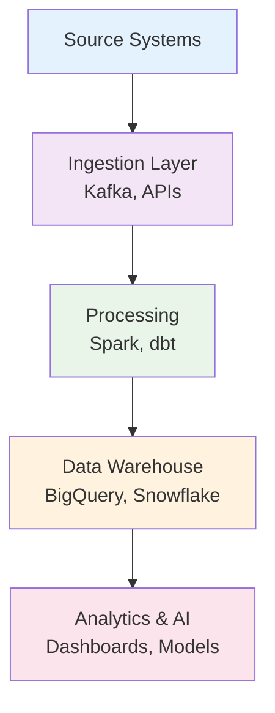
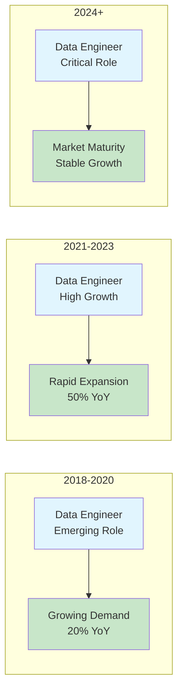

# The Data Engineer in the Enterprise: Powering AI and Analytics at Scale

## Abstract

Data Engineers are the unsung heroes of the modern data stack. They build the pipelines, warehouses, and infrastructure that enable organizations to unlock insights, power machine learning, and make data-driven decisions. This article explores the evolution, responsibilities, required skills, challenges, and future trends shaping the role of Data Engineers in enterprises.

---

## Introduction

As organizations become more reliant on data for operations, decision-making, and AI applications, the role of Data Engineers has become increasingly vital. While data scientists and ML engineers build models, Data Engineers ensure that trustworthy, timely data is available to power those models and dashboards (Forbes 2025).

---

## Role Definition & Evolution

Data Engineers design, implement, and maintain the systems that move, store, and process data. Unlike data analysts or scientists who extract insights, Data Engineers ensure that the underlying architecture is scalable, efficient, and reliable. With the rise of cloud platforms, real-time analytics, and AI, the role has expanded to include streaming, orchestration, and data quality (LinkedIn 2024).

---

## Core Responsibilities

1. **ETL/ELT Pipeline Design**: Building and managing extract-transform-load (or load-then-transform) processes to ingest data from various sources.
2. **Data Warehousing**: Creating scalable storage systems (e.g., Snowflake, Redshift, BigQuery) optimized for querying and reporting.
3. **Data Modeling**: Structuring raw data into clean, normalized, or denormalized schemas that support analytics and AI use cases.
4. **Streaming & Real-Time Processing**: Implementing Kafka, Spark Streaming, or Flink pipelines to enable real-time data applications.
5. **Data Quality & Monitoring**: Ensuring reliability, accuracy, and freshness of data through observability, testing, and validation tools.
6. **Collaboration**: Working with analysts, scientists, and ML engineers to ensure data readiness for downstream tasks.

---

## Visual: Data Engineer Infrastructure Workflow

*This flowchart shows how Data Engineers enable the flow from raw data to insight-driven applications.*

---

## Skill Requirements

**Technical Skills**:
- Languages: Python, SQL, Scala, Java.
- Tools: Airflow, dbt, Spark, Kafka, Beam, Flink.
- Warehouses: Snowflake, Redshift, BigQuery, Databricks.
- Cloud Platforms: AWS, GCP, Azure (focus on data services).
- DevOps: Docker, Terraform, CI/CD pipelines for data.

**Soft Skills**:
- Reliability Engineering: Thinking in terms of uptime, SLA, data contracts.
- Data Governance: Ensuring privacy, access control, lineage, and compliance.
- Stakeholder Communication: Translating data availability into business value.

---

## Industry Demand & Market Trends

According to Indeed and Dice reports, Data Engineer has been one of the fastest-growing jobs in tech since 2020. In 2024, median U.S. salaries reached $135,000, with top talent earning over $180,000. The rise of the modern data stack has made this role foundational to any digital-first company (Indeed 2024).

---

## Visual: Data Engineering Demand Growth

*Demand for data engineers has consistently grown due to the explosion of data tools and pipelines.*

---

## Challenges & Best Practices

- **Data Silos**: Consolidate data into unified lakes/warehouses to break down departmental barriers.
- **Pipeline Complexity**: Use orchestration and modular design (e.g., dbt, Airflow) to avoid monoliths.
- **Data Quality**: Implement testing frameworks (Great Expectations, Soda) and real-time anomaly detection.
- **Scaling**: Leverage cloud-native architectures and cost-aware design (partitioning, compression, job scheduling).
- **Documentation & Contracts**: Track schema evolution, ownership, and usage contracts for reliable consumption.

---

## Case Studies

### 1. Airbnb

Airbnb's data engineering team built Minerva, a semantic data modeling platform that standardized metrics across teams and reduced data inconsistencies (Airbnb Tech Blog 2023).

### 2. Shopify

Shopify uses streaming data pipelines to deliver real-time metrics to merchants. Engineers built self-healing Kafka pipelines monitored via custom dashboards (Shopify Engineering 2024).

### 3. DoorDash

DoorDash scaled its data platform to support logistics AI by migrating from Hadoop to Snowflake and implementing dbt for transformation logic (DoorDash Engineering 2023).

---

## Future Outlook

Data Engineers are becoming increasingly focused on:
- Data contracts and formal APIs for data delivery.
- Real-time and event-driven architectures.
- Metadata management and active observability.
- Data mesh architectures for decentralized scalability.
- Supporting ML pipelines with feature stores and lineage.

---

## Conclusion

Data Engineers are the foundation of any data-driven company. They ensure that clean, reliable data flows through the organization, enabling AI, analytics, and automation. As data infrastructure evolves, Data Engineers will play an even more strategic role in shaping how companies work with data at scale.

---

## Works Cited

Airbnb Tech Blog. "Introducing Minerva: A Unified Metric Platform." 2023.

DoorDash Engineering. "How DoorDash Scaled Its Data Platform." 2023.

Forbes. "The Rise of the Modern Data Engineer." 2025.

Indeed. "Data Engineer Salary & Growth Report." 2024.

LinkedIn. "Top 10 Emerging Roles in Data." 2024.

Shopify Engineering. "Streaming at Scale for Commerce." 2024.
