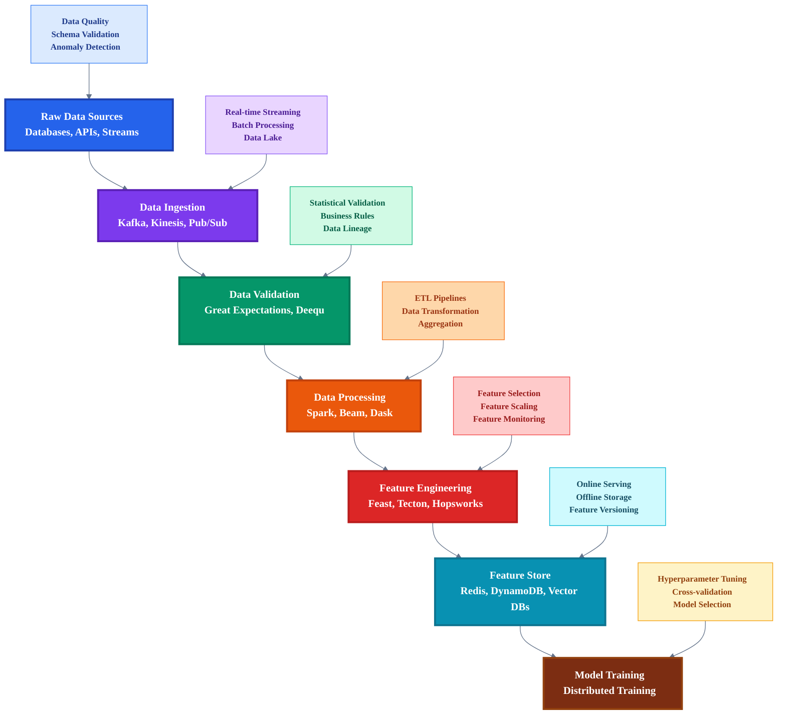
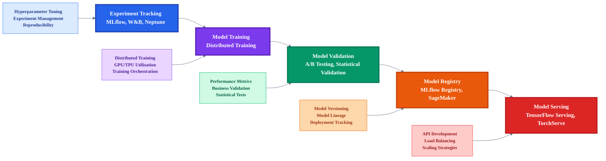
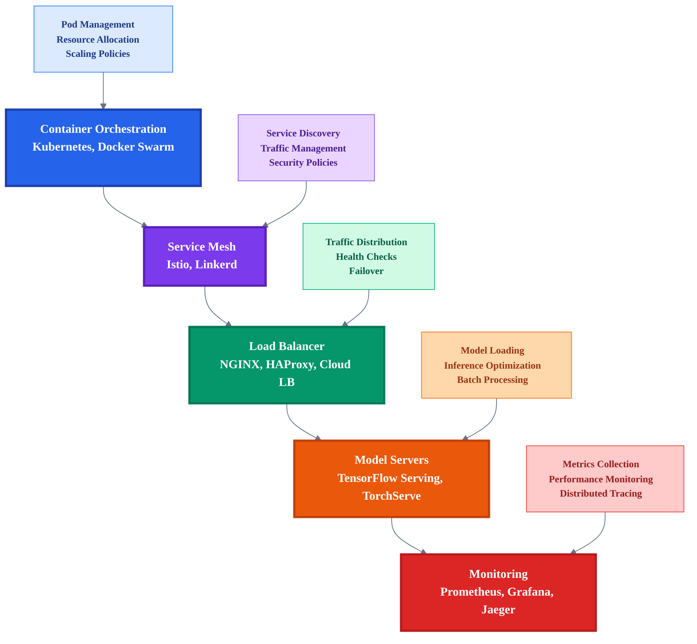
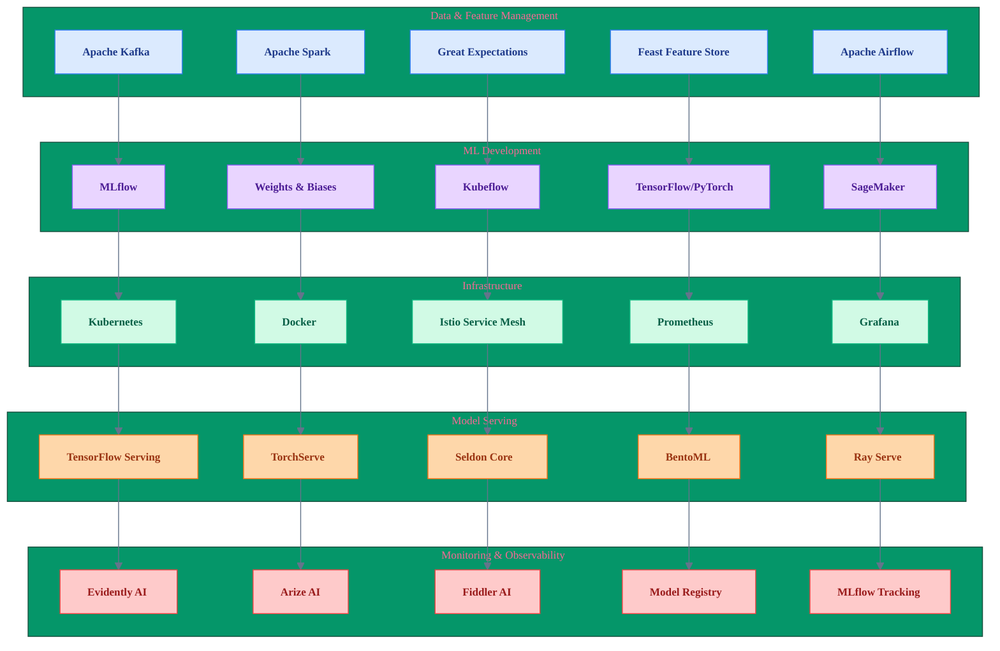

# MLOps Architecture Guide: Building Production-Ready ML Systems

> **Navigation**: [🏠 Home](../../README.md) | [🔬 ML Engineer](../roles/ml-engineer.md) | [📊 Data Scientist](../roles/data-scientist.md) | [🤖 AI Engineer](../roles/ai-engineer.md) | [📊 Data Engineer](../roles/data-engineer.md) | [💻 AI Developer](../roles/ai-developer.md) | [📋 Assessment](../assessment/skills-assessment.md)

---

## Overview

This guide provides a comprehensive framework for designing and implementing MLOps architectures that support the full machine learning lifecycle. It complements the ML Engineer role by providing practical implementation patterns and best practices.

---

## MLOps Architecture Principles

### 1. **Automation First**
- Automate every step of the ML lifecycle
- Reduce manual intervention and human error
- Enable rapid iteration and deployment

### 2. **Reproducibility**
- Version control for code, data, and models
- Deterministic training and inference
- Complete lineage tracking

### 3. **Scalability**
- Horizontal scaling for training and inference
- Efficient resource utilization
- Cost optimization strategies

### 4. **Observability**
- Comprehensive monitoring and logging
- Real-time performance tracking
- Proactive alerting and debugging

---

## Visual: MLOps Architecture Overview

```mermaid
%%{init: {'theme': 'base', 'themeVariables': { 'fontSize': '14px', 'fontFamily': 'Segoe UI, Arial, sans-serif', 'primaryColor': '#2563eb', 'primaryTextColor': '#ffffff', 'primaryBorderColor': '#1e40af', 'lineColor': '#64748b', 'secondaryColor': '#7c3aed', 'tertiaryColor': '#059669'}}}%%
graph TB
    subgraph "Data Layer"
        A1["Raw Data Sources"]
        A2["Data Ingestion"]
        A3["Data Validation"]
        A4["Data Processing"]
        A5["Feature Engineering"]
        A6["Feature Store"]
    end
    
    subgraph "ML Development Layer"
        B1["Experiment Tracking"]
        B2["Model Training"]
        B3["Model Validation"]
        B4["Model Registry"]
        B5["Model Serving"]
    end
    
    subgraph "Infrastructure Layer"
        C1["Container Orchestration"]
        C2["Service Mesh"]
        C3["Load Balancer"]
        C4["Model Servers"]
        C5["Monitoring"]
    end
    
    subgraph "Operations Layer"
        D1["CI/CD Pipeline"]
        D2["Deployment Management"]
        D3["Performance Monitoring"]
        D4["Alerting & Logging"]
        D5["Governance & Compliance"]
    end
    
    A1 --> A2 --> A3 --> A4 --> A5 --> A6
    A6 --> B1 --> B2 --> B3 --> B4 --> B5
    B5 --> C1 --> C2 --> C3 --> C4 --> C5
    C5 --> D1 --> D2 --> D3 --> D4 --> D5
    
    style A1 fill:#dbeafe,stroke:#3b82f6,stroke-width:2px,color:#1e3a8a,font-weight:bold
    style A2 fill:#dbeafe,stroke:#3b82f6,stroke-width:2px,color:#1e3a8a,font-weight:bold
    style A3 fill:#dbeafe,stroke:#3b82f6,stroke-width:2px,color:#1e3a8a,font-weight:bold
    style A4 fill:#dbeafe,stroke:#3b82f6,stroke-width:2px,color:#1e3a8a,font-weight:bold
    style A5 fill:#dbeafe,stroke:#3b82f6,stroke-width:2px,color:#1e3a8a,font-weight:bold
    style A6 fill:#dbeafe,stroke:#3b82f6,stroke-width:2px,color:#1e3a8a,font-weight:bold
    
    style B1 fill:#e9d5ff,stroke:#8b5cf6,stroke-width:2px,color:#4c1d95,font-weight:bold
    style B2 fill:#e9d5ff,stroke:#8b5cf6,stroke-width:2px,color:#4c1d95,font-weight:bold
    style B3 fill:#e9d5ff,stroke:#8b5cf6,stroke-width:2px,color:#4c1d95,font-weight:bold
    style B4 fill:#e9d5ff,stroke:#8b5cf6,stroke-width:2px,color:#4c1d95,font-weight:bold
    style B5 fill:#e9d5ff,stroke:#8b5cf6,stroke-width:2px,color:#4c1d95,font-weight:bold
    
    style C1 fill:#d1fae5,stroke:#10b981,stroke-width:2px,color:#065f46,font-weight:bold
    style C2 fill:#d1fae5,stroke:#10b981,stroke-width:2px,color:#065f46,font-weight:bold
    style C3 fill:#d1fae5,stroke:#10b981,stroke-width:2px,color:#065f46,font-weight:bold
    style C4 fill:#d1fae5,stroke:#10b981,stroke-width:2px,color:#065f46,font-weight:bold
    style C5 fill:#d1fae5,stroke:#10b981,stroke-width:2px,color:#065f46,font-weight:bold
    
    style D1 fill:#fed7aa,stroke:#f97316,stroke-width:2px,color:#9a3412,font-weight:bold
    style D2 fill:#fed7aa,stroke:#f97316,stroke-width:2px,color:#9a3412,font-weight:bold
    style D3 fill:#fed7aa,stroke:#f97316,stroke-width:2px,color:#9a3412,font-weight:bold
    style D4 fill:#fed7aa,stroke:#f97316,stroke-width:2px,color:#9a3412,font-weight:bold
    style D5 fill:#fed7aa,stroke:#f97316,stroke-width:2px,color:#9a3412,font-weight:bold
```

*Figure 1: Complete MLOps architecture showing the four main layers and their interconnections.*

---

## Core Architecture Components

### **1. Data Pipeline Layer**

*Figure 2: Data pipeline layer showing the complete flow from raw data to model training with supporting tools and technologies.*

**Key Components:**
- **Data Ingestion**: Apache Kafka, AWS Kinesis, Google Pub/Sub
- **Data Validation**: Great Expectations, Deequ, TensorFlow Data Validation
- **Data Processing**: Apache Spark, Apache Beam, Dask
- **Feature Engineering**: Feast, Tecton, Hopsworks
- **Feature Store**: Redis, DynamoDB, Vector databases

### **2. Model Development Layer**

*Figure 3: Model development layer showing the complete ML workflow from experimentation to deployment.*

**Key Components:**
- **Experiment Tracking**: MLflow, Weights & Biases, Neptune
- **Model Training**: Distributed training frameworks, hyperparameter optimization
- **Model Validation**: A/B testing, statistical validation, business metrics
- **Model Registry**: MLflow Model Registry, AWS SageMaker Model Registry
- **Model Serving**: TensorFlow Serving, TorchServe, Seldon Core

### **3. Infrastructure Layer**

*Figure 4: Infrastructure layer showing the deployment and serving architecture with supporting components.*

---

## Visual: MLOps Workflow Patterns

```mermaid
%%{init: {'theme': 'base', 'themeVariables': { 'fontSize': '13px', 'fontFamily': 'Segoe UI, Arial, sans-serif', 'primaryColor': '#2563eb', 'primaryTextColor': '#ffffff', 'primaryBorderColor': '#1e40af', 'lineColor': '#64748b', 'secondaryColor': '#7c3aed', 'tertiaryColor': '#059669'}}}%%
flowchart TD
    subgraph "Development Phase"
        A1["Code Development"]
        A2["Data Preparation"]
        A3["Experiment Tracking"]
        A4["Model Training"]
    end
    
    subgraph "Testing Phase"
        B1["Unit Testing"]
        B2["Integration Testing"]
        B3["Model Validation"]
        B4["Performance Testing"]
    end
    
    subgraph "Deployment Phase"
        C1["Model Packaging"]
        C2["Deployment Pipeline"]
        C3["Canary Deployment"]
        C4["Production Rollout"]
    end
    
    subgraph "Operations Phase"
        D1["Monitoring"]
        D2["Performance Tracking"]
        D3["Model Retraining"]
        D4["Rollback Management"]
    end
    
    A1 --> A2 --> A3 --> A4
    A4 --> B1 --> B2 --> B3 --> B4
    B4 --> C1 --> C2 --> C3 --> C4
    C4 --> D1 --> D2 --> D3 --> D4
    D3 --> A1
    
    style A1 fill:#dbeafe,stroke:#3b82f6,stroke-width:2px,color:#1e3a8a,font-weight:bold
    style A2 fill:#dbeafe,stroke:#3b82f6,stroke-width:2px,color:#1e3a8a,font-weight:bold
    style A3 fill:#dbeafe,stroke:#3b82f6,stroke-width:2px,color:#1e3a8a,font-weight:bold
    style A4 fill:#dbeafe,stroke:#3b82f6,stroke-width:2px,color:#1e3a8a,font-weight:bold
    
    style B1 fill:#e9d5ff,stroke:#8b5cf6,stroke-width:2px,color:#4c1d95,font-weight:bold
    style B2 fill:#e9d5ff,stroke:#8b5cf6,stroke-width:2px,color:#4c1d95,font-weight:bold
    style B3 fill:#e9d5ff,stroke:#8b5cf6,stroke-width:2px,color:#4c1d95,font-weight:bold
    style B4 fill:#e9d5ff,stroke:#8b5cf6,stroke-width:2px,color:#4c1d95,font-weight:bold
    
    style C1 fill:#d1fae5,stroke:#10b981,stroke-width:2px,color:#065f46,font-weight:bold
    style C2 fill:#d1fae5,stroke:#10b981,stroke-width:2px,color:#065f46,font-weight:bold
    style C3 fill:#d1fae5,stroke:#10b981,stroke-width:2px,color:#065f46,font-weight:bold
    style C4 fill:#d1fae5,stroke:#10b981,stroke-width:2px,color:#065f46,font-weight:bold
    
    style D1 fill:#fed7aa,stroke:#f97316,stroke-width:2px,color:#9a3412,font-weight:bold
    style D2 fill:#fed7aa,stroke:#f97316,stroke-width:2px,color:#9a3412,font-weight:bold
    style D3 fill:#fed7aa,stroke:#f97316,stroke-width:2px,color:#9a3412,font-weight:bold
    style D4 fill:#fed7aa,stroke:#f97316,stroke-width:2px,color:#9a3412,font-weight:bold
```

*Figure 5: MLOps workflow patterns showing the continuous cycle from development to operations with feedback loops.*

---

## Visual: MLOps Technology Stack

*Figure 6: Comprehensive MLOps technology stack showing tools and platforms across all layers of the architecture.*