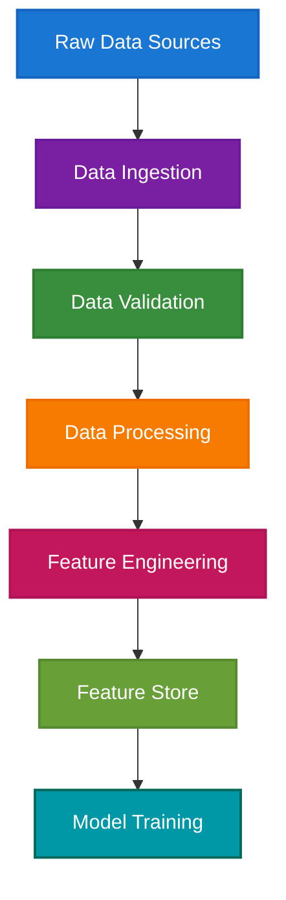
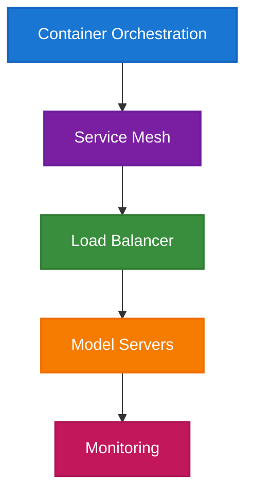

# MLOps Architecture Guide: Building Production-Ready ML Systems

> **Navigation**: [🏠 Home](../../README.md) | [🔬 ML Engineer](../roles/ml-engineer.md) | [📊 Data Scientist](../roles/data-scientist.md) | [🤖 AI Engineer](../roles/ai-engineer.md) | [📊 Data Engineer](../roles/data-engineer.md) | [💻 AI Developer](../roles/ai-developer.md) | [📋 Assessment](../assessment/skills-assessment.md)

---

## Overview

This guide provides a comprehensive framework for designing and implementing MLOps architectures that support the full machine learning lifecycle. It complements the ML Engineer role by providing practical implementation patterns and best practices.

---

## MLOps Architecture Principles

### 1. **Automation First**
- Automate every step of the ML lifecycle
- Reduce manual intervention and human error
- Enable rapid iteration and deployment

### 2. **Reproducibility**
- Version control for code, data, and models
- Deterministic training and inference
- Complete lineage tracking

### 3. **Scalability**
- Horizontal scaling for training and inference
- Efficient resource utilization
- Cost optimization strategies

### 4. **Observability**
- Comprehensive monitoring and logging
- Real-time performance tracking
- Proactive alerting and debugging

---

## Core Architecture Components

### **1. Data Pipeline Layer**



**Key Components:**
- **Data Ingestion**: Apache Kafka, AWS Kinesis, Google Pub/Sub
- **Data Validation**: Great Expectations, Deequ, TensorFlow Data Validation
- **Data Processing**: Apache Spark, Apache Beam, Dask
- **Feature Engineering**: Feast, Tecton, Hopsworks
- **Feature Store**: Redis, DynamoDB, Vector databases

### **2. Model Development Layer**


**Key Components:**
- **Experiment Tracking**: MLflow, Weights & Biases, Neptune
- **Model Training**: Distributed training frameworks, hyperparameter optimization
- **Model Validation**: A/B testing, statistical validation, business metrics
- **Model Registry**: MLflow Model Registry, AWS SageMaker Model Registry
- **Model Serving**: TensorFlow Serving, TorchServe, Seldon Core

### **3. Infrastructure Layer**



**Key Components:**
- **Container Orchestration**: Kubernetes, Docker Swarm, AWS ECS
- **Service Mesh**: Istio, Linkerd, Consul
- **Load Balancing**: NGINX, HAProxy, cloud load balancers
- **Model Servers**: Custom inference servers, managed services
- **Monitoring**: Prometheus, Grafana, custom dashboards

---

## Implementation Patterns

### **Pattern 1: Batch Training Pipeline**

```yaml
# Example Airflow DAG for batch training
dag:
  schedule_interval: "0 2 * * *"  # Daily at 2 AM
  
stages:
  - name: data_validation
    task: validate_data_quality
    timeout: 3600
    
  - name: feature_engineering
    task: compute_features
    timeout: 7200
    
  - name: model_training
    task: train_model
    timeout: 14400
    
  - name: model_evaluation
    task: evaluate_model
    timeout: 1800
    
  - name: model_deployment
    task: deploy_model
    timeout: 900
```

### **Pattern 2: Real-Time Inference Pipeline**

```python
# Example FastAPI model serving
from fastapi import FastAPI, HTTPException
from pydantic import BaseModel
import mlflow
import numpy as np

app = FastAPI()

class PredictionRequest(BaseModel):
    features: list[float]

class PredictionResponse(BaseModel):
    prediction: float
    confidence: float
    model_version: str

@app.post("/predict", response_model=PredictionResponse)
async def predict(request: PredictionRequest):
    try:
        # Load model from registry
        model = mlflow.pyfunc.load_model("models:/fraud-detection/Production")
        
        # Make prediction
        features = np.array(request.features).reshape(1, -1)
        prediction = model.predict(features)[0]
        
        return PredictionResponse(
            prediction=float(prediction),
            confidence=0.95,
            model_version="v1.2.3"
        )
    except Exception as e:
        raise HTTPException(status_code=500, detail=str(e))
```

### **Pattern 3: A/B Testing Framework**

```python
# Example A/B testing implementation
class ABTestManager:
    def __init__(self):
        self.experiments = {}
    
    def create_experiment(self, name, variants, traffic_split):
        self.experiments[name] = {
            'variants': variants,
            'traffic_split': traffic_split,
            'metrics': {}
        }
    
    def get_variant(self, user_id, experiment_name):
        if experiment_name not in self.experiments:
            return 'control'
        
        # Deterministic assignment based on user_id
        hash_value = hash(user_id) % 100
        cumulative = 0
        
        for variant, percentage in self.experiments[experiment_name]['traffic_split'].items():
            cumulative += percentage
            if hash_value < cumulative:
                return variant
        
        return 'control'
```

---

## Monitoring & Observability

### **1. Model Performance Monitoring**

```python
# Example monitoring implementation
class ModelMonitor:
    def __init__(self):
        self.metrics = {}
    
    def log_prediction(self, model_id, features, prediction, actual=None):
        # Log prediction metrics
        self.metrics.setdefault(model_id, []).append({
            'timestamp': time.time(),
            'features': features,
            'prediction': prediction,
            'actual': actual
        })
    
    def detect_drift(self, model_id, window_size=1000):
        recent_predictions = self.metrics[model_id][-window_size:]
        
        # Calculate statistical drift
        feature_means = np.mean([p['features'] for p in recent_predictions], axis=0)
        baseline_means = self.get_baseline_means(model_id)
        
        drift_score = np.mean(np.abs(feature_means - baseline_means))
        return drift_score > 0.1  # Threshold for drift detection
```

### **2. Business Metrics Tracking**

```python
# Example business metrics implementation
class BusinessMetricsTracker:
    def __init__(self):
        self.metrics = defaultdict(list)
    
    def track_conversion(self, user_id, prediction, actual_conversion):
        revenue = actual_conversion * 100  # Example: $100 per conversion
        
        self.metrics['conversion_rate'].append(actual_conversion)
        self.metrics['revenue'].append(revenue)
        self.metrics['prediction_accuracy'].append(
            1 if (prediction > 0.5) == actual_conversion else 0
        )
    
    def get_roi(self, model_id):
        total_revenue = sum(self.metrics['revenue'])
        total_cost = len(self.metrics['revenue']) * 0.01  # Cost per prediction
        
        return (total_revenue - total_cost) / total_cost
```

---

## Security & Compliance

### **1. Data Security**

```python
# Example data encryption and access control
import hashlib
from cryptography.fernet import Fernet

class SecureDataHandler:
    def __init__(self, encryption_key):
        self.cipher = Fernet(encryption_key)
    
    def encrypt_features(self, features):
        features_str = json.dumps(features)
        return self.cipher.encrypt(features_str.encode())
    
    def decrypt_features(self, encrypted_features):
        decrypted = self.cipher.decrypt(encrypted_features)
        return json.loads(decrypted.decode())
    
    def hash_user_id(self, user_id):
        return hashlib.sha256(user_id.encode()).hexdigest()
```

### **2. Model Security**

```python
# Example model security measures
class SecureModelServer:
    def __init__(self, model_path, encryption_key):
        self.model = self.load_encrypted_model(model_path, encryption_key)
        self.rate_limiter = RateLimiter(max_requests=1000, window=60)
    
    def predict(self, features, user_id):
        # Rate limiting
        if not self.rate_limiter.allow_request(user_id):
            raise HTTPException(status_code=429, detail="Rate limit exceeded")
        
        # Input validation
        if not self.validate_features(features):
            raise HTTPException(status_code=400, detail="Invalid features")
        
        # Make prediction
        prediction = self.model.predict(features)
        
        # Log for audit
        self.audit_log.log_prediction(user_id, features, prediction)
        
        return prediction
```

---

## Deployment Strategies

### **1. Blue-Green Deployment**

```yaml
# Example Kubernetes blue-green deployment
apiVersion: apps/v1
kind: Deployment
metadata:
  name: ml-model-blue
spec:
  replicas: 3
  selector:
    matchLabels:
      app: ml-model
      version: blue
  template:
    metadata:
      labels:
        app: ml-model
        version: blue
    spec:
      containers:
      - name: ml-model
        image: ml-model:v1.2.3
        ports:
        - containerPort: 8080
---
apiVersion: v1
kind: Service
metadata:
  name: ml-model-service
spec:
  selector:
    app: ml-model
    version: blue  # Switch to green for new version
  ports:
  - port: 80
    targetPort: 8080
```