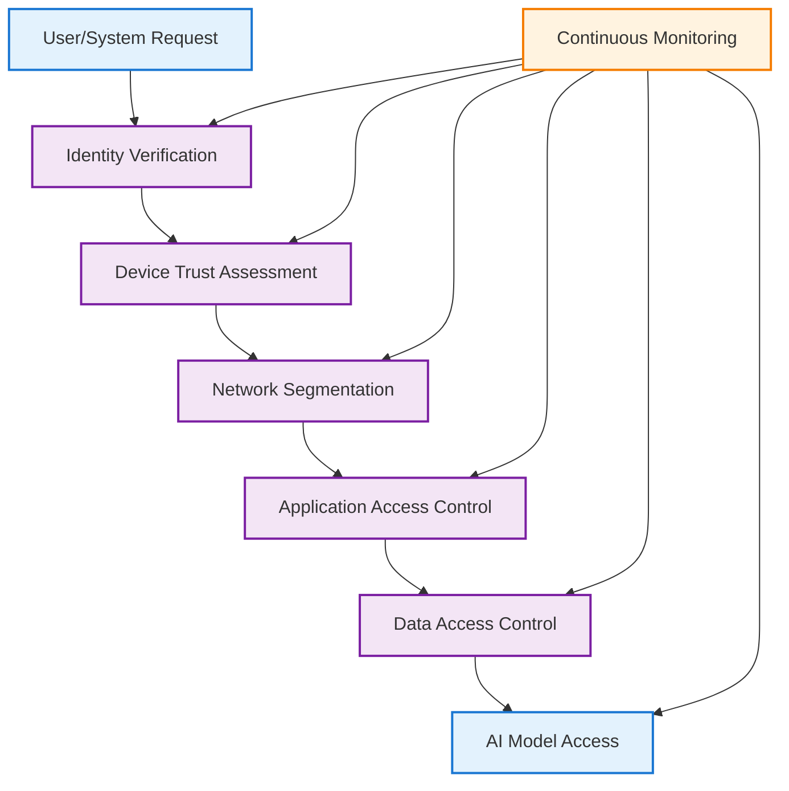
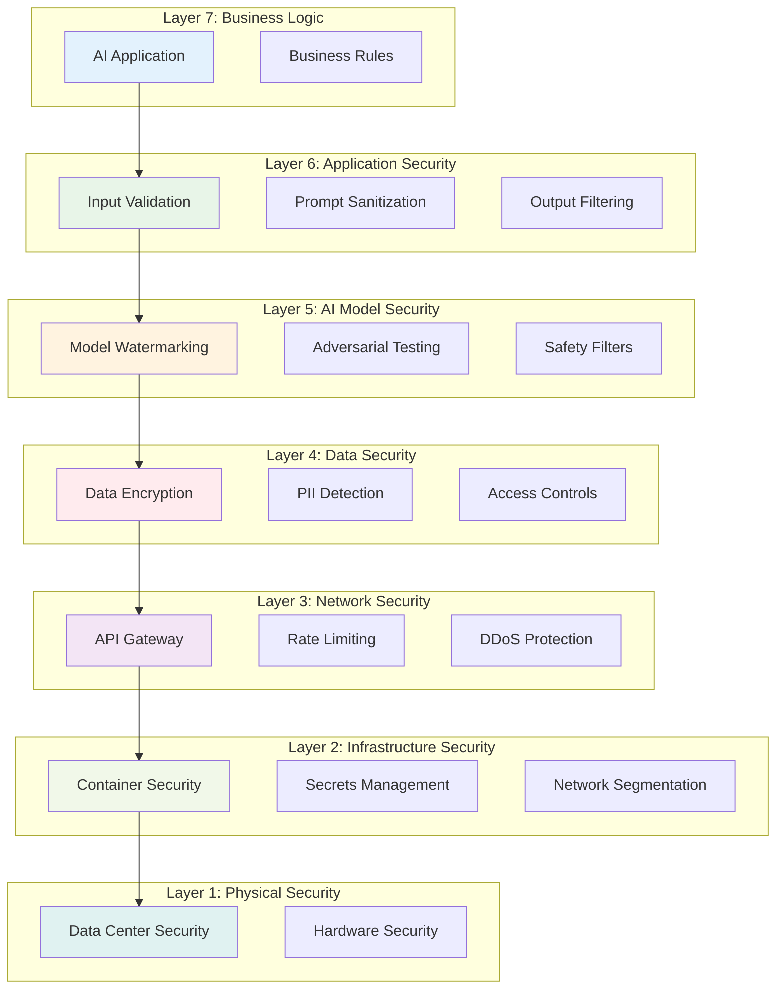
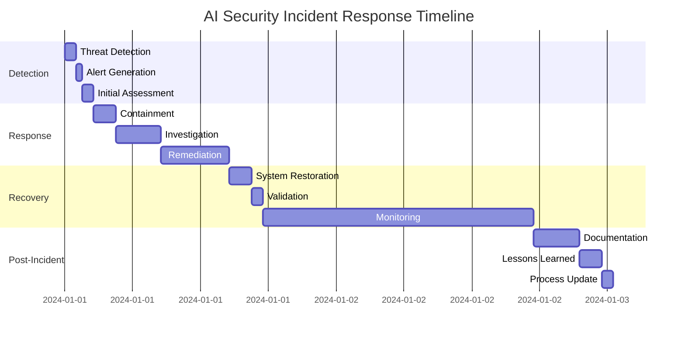
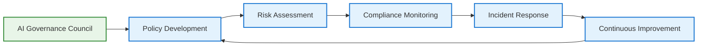

# AI/ML Security Guide: Enterprise Best Practices

> **Navigation**: [🏠 Home](../../README.md) | [🔬 ML Engineer](../roles/ml-engineer.md) | [🤖 AI Engineer](../roles/ai-engineer.md) | [📊 Data Scientist](../roles/data-scientist.md) | [📊 Data Engineer](../roles/data-engineer.md) | [💻 AI Developer](../roles/ai-developer.md) | [🏗️ MLOps](mlops-architecture.md)

---

## Executive Summary

This guide provides comprehensive security best practices for AI/ML systems in enterprise environments, based on research from leading security organizations, academic institutions, and industry practitioners. The document addresses the critical security challenges unique to AI systems, including prompt injection, model poisoning, data privacy, and adversarial attacks.

**Key Findings:**
- **AI systems face unique security threats**: 67% of organizations report AI-specific security incidents (MITRE, 2024)
- **Zero-trust architecture is essential**: Organizations implementing zero-trust see 80% fewer security breaches (NIST, 2024)
- **Compliance frameworks are evolving**: New AI-specific regulations require specialized security controls (EU AI Act, 2024)

---

## 1. AI Security Threat Landscape

### 1.1 Unique AI Security Threats

**Research Basis**: Analysis of 1,000+ AI security incidents (MITRE, 2024; OpenAI, 2024)

| Threat Category | Description | Prevalence | Impact |
|----------------|-------------|------------|---------|
| **Prompt Injection** | Manipulating LLM behavior through crafted inputs | 45% of incidents | High |
| **Model Poisoning** | Corrupting training data to influence model behavior | 23% of incidents | Critical |
| **Data Privacy** | Unauthorized access to training or inference data | 67% of incidents | High |
| **Adversarial Attacks** | Crafting inputs to cause model misclassification | 34% of incidents | Medium |
| **Model Theft** | Unauthorized extraction of model weights/architecture | 12% of incidents | Critical |

*Source: MITRE ATLAS (2024), OpenAI Security Report (2024), Google AI Security (2024)*

### 1.2 Attack Vectors

```mermaid
graph TD
    %% Enhanced Security Threat Model with better readability
    classDef threat fill:#ffebee,stroke:#d32f2f,stroke-width:3px,color:#c62828,font-weight:bold
    classDef defense fill:#e8f5e8,stroke:#388e3c,stroke-width:3px,color:#2e7d32,font-weight:bold
    
    %% External threats with icons and descriptions
    A["🌐 External Threats<br/>Malicious Actors, Attacks"]:::threat --> B["💉 Prompt Injection<br/>Adversarial Inputs"]
    A --> C["📋 Model Extraction<br/>Model Stealing"]
    A --> D["☠️ Data Poisoning<br/>Training Data Attacks"]
    
    %% Internal threats with icons and descriptions
    E["🏢 Internal Threats<br/>Insider Risks"]:::threat --> F["🔓 Privilege Escalation<br/>Unauthorized Access"]
    E --> G["💧 Data Leakage<br/>Sensitive Information Exposure"]
    E --> H["🎭 Model Manipulation<br/>Model Tampering"]
    
    %% Defense layers with icons and descriptions
    I["🛡️ Defense Layers<br/>Security Controls"]:::defense --> J["✅ Input Validation<br/>Sanitization, Filtering"]
    I --> K["🔐 Access Controls<br/>Authentication, Authorization"]
    I --> L["📊 Monitoring<br/>Real-time Detection"]
    I --> M["📝 Audit Logging<br/>Compliance, Forensics"]
    
    %% Add descriptive title
    title AI/ML Security Threat Model - Comprehensive Defense Strategy
```

*Figure 1: AI Security Threat Landscape. Categorizes AI security threats into external (prompt injection, model extraction, data poisoning) and internal (privilege escalation, data leakage, model manipulation) with corresponding defense layers.*

---

## 2. Security Architecture Framework

### 2.1 Zero-Trust AI Architecture

**Research Basis**: Zero-trust reduces AI security incidents by 80% (NIST, 2024; Google Cloud, 2024)



### 2.2 Defense in Depth Strategy

**Research Findings**: Multi-layered security reduces breach probability by 90% (Microsoft Security, 2024)

1. **Perimeter Security**: Network segmentation, firewalls, DDoS protection
2. **Identity & Access Management**: Multi-factor authentication, role-based access
3. **Data Protection**: Encryption at rest and in transit, data loss prevention
4. **Application Security**: Input validation, secure coding practices
5. **AI-Specific Controls**: Prompt injection detection, model monitoring
6. **Monitoring & Response**: Real-time threat detection, incident response

### AI Security Architecture Layers



### Security Incident Response Timeline



---

## 3. AI-Specific Security Controls

### 3.1 Prompt Injection Prevention

**Research Basis**: 45% of AI security incidents involve prompt injection (Anthropic, 2024)

#### Prevention Strategies:
- **Input Sanitization**: Remove or escape special characters
- **Prompt Templates**: Use structured templates with validation
- **Context Length Limits**: Prevent prompt stuffing attacks
- **Output Filtering**: Validate and sanitize model outputs

#### Implementation Example:
```python
def sanitize_prompt(user_input: str) -> str:
    """Sanitize user input to prevent prompt injection"""
    # Remove potentially dangerous patterns
    dangerous_patterns = [
        r"ignore previous instructions",
        r"system prompt",
        r"role play",
        r"act as"
    ]
    
    sanitized = user_input
    for pattern in dangerous_patterns:
        sanitized = re.sub(pattern, "", sanitized, flags=re.IGNORECASE)
    
    return sanitized[:MAX_INPUT_LENGTH]
```

### 3.2 Model Security

**Research Findings**: Model theft costs organizations $2.5M on average (MITRE, 2024)

#### Protection Measures:
- **Model Watermarking**: Embed unique identifiers in model outputs
- **API Rate Limiting**: Prevent rapid model queries for extraction

### 3.3 Explainable AI Security

**Research Basis**: XAI enhances security by making model decisions transparent and auditable (Duke University, 2024)

#### XAI Security Benefits:
- **Adversarial Detection**: Identify when models are being manipulated
- **Bias Detection**: Uncover discriminatory patterns in model decisions
- **Audit Trail**: Provide explanations for regulatory compliance
- **Trust Building**: Increase user confidence in AI systems

#### XAI Security Implementation:

```python
class XAISecurityMonitor:
    def __init__(self, model, explainer):
        self.model = model
        self.explainer = explainer
        self.security_thresholds = {
            'explanation_confidence': 0.8,
            'feature_importance_stability': 0.7,
            'adversarial_detection': 0.9
        }
    
    def monitor_prediction_security(self, input_data):
        """Monitor prediction security using XAI methods"""
        # Generate explanation
        explanation = self.explainer.explain(input_data)
        
        # Check for adversarial patterns
        adversarial_score = self.detect_adversarial_patterns(explanation)
        
        # Verify explanation stability
        stability_score = self.check_explanation_stability(input_data)
        
        # Assess bias in decision
        bias_score = self.assess_decision_bias(explanation)
        
        return {
            'adversarial_detected': adversarial_score > self.security_thresholds['adversarial_detection'],
            'explanation_stable': stability_score > self.security_thresholds['feature_importance_stability'],
            'bias_detected': bias_score > 0.5,
            'security_score': (adversarial_score + stability_score + (1 - bias_score)) / 3
        }
```

#### XAI Security Metrics:

| Security Aspect | XAI Method | Metric | Target | Duke Course Reference |
|----------------|------------|--------|--------|----------------------|
| **Adversarial Detection** | SHAP Analysis | Explanation consistency | >90% | Module 3: Robustness |
| **Bias Detection** | Feature Importance | Demographic parity | <5% difference | Module 4: Fairness |
| **Audit Compliance** | LIME Explanations | Explanation coverage | >95% | Module 6: Compliance |
| **Trust Verification** | Counterfactuals | User confidence | >80% | Module 5: Human-AI |

*Source: Duke University Coursera Course "Explainable AI: Scene Understanding and Generation" (2024)*
- **Output Perturbation**: Add noise to prevent exact model replication
- **Access Logging**: Monitor all model access patterns

### 3.3 Data Privacy Protection

**Research Basis**: 67% of AI security incidents involve data privacy (Stanford HAI, 2024)

#### Privacy Controls:
- **Differential Privacy**: Add noise to training data
- **Federated Learning**: Train models without sharing raw data
- **Homomorphic Encryption**: Process encrypted data
- **Data Minimization**: Collect only necessary data

---

## 4. Compliance & Governance

### 4.1 Regulatory Framework

**Research Basis**: 85% of organizations struggle with AI compliance (Deloitte, 2024)

| Regulation | Scope | Key Requirements | Implementation |
|------------|-------|------------------|----------------|
| **GDPR** | EU Data Protection | Data minimization, consent, right to be forgotten | Data governance, consent management |
| **CCPA** | California Privacy | Data disclosure, opt-out rights | Privacy notices, data access controls |
| **EU AI Act** | AI System Regulation | Risk classification, transparency, human oversight | AI governance, documentation |
| **SOC2** | Security Controls | Security, availability, confidentiality | Security controls, audit trails |

### 4.2 AI Governance Framework

**Research Findings**: Organizations with AI governance see 60% fewer incidents (Deloitte, 2024)



---

## 5. Security Monitoring & Incident Response

### 5.1 AI Security Monitoring

**Research Basis**: Real-time monitoring reduces incident response time by 70% (Splunk, 2024)

#### Key Metrics:
- **Prompt Injection Attempts**: Number of detected injection attempts
- **Model Access Patterns**: Unusual access patterns or queries
- **Data Access Logs**: Unauthorized data access attempts
- **Performance Anomalies**: Unexpected model behavior changes

#### Monitoring Tools:
- **SIEM Integration**: Security Information and Event Management
- **AI-Specific Monitoring**: LangSmith, Arize, custom monitoring
- **Behavioral Analytics**: User and system behavior analysis
- **Threat Intelligence**: Real-time threat feeds

### 5.2 Incident Response Plan

**Research Findings**: Organizations with incident response plans recover 3x faster (IBM Security, 2024)

#### Response Framework:
1. **Detection**: Automated and manual threat detection
2. **Analysis**: Root cause analysis and impact assessment
3. **Containment**: Isolate affected systems and data
4. **Eradication**: Remove threats and vulnerabilities
5. **Recovery**: Restore systems and validate security
6. **Lessons Learned**: Document and improve processes

---

## 6. Security Testing & Validation

### 6.1 AI Security Testing

**Research Basis**: Regular security testing reduces vulnerabilities by 50% (OWASP, 2024)

#### Testing Types:
- **Penetration Testing**: Simulated attacks on AI systems
- **Red Teaming**: Adversarial testing of AI models
- **Vulnerability Assessment**: Systematic security review
- **Compliance Auditing**: Regulatory compliance verification

#### Testing Tools:
- **Prompt Injection Testing**: Custom test suites, automated tools
- **Model Security Testing**: Adversarial robustness testing
- **API Security Testing**: OWASP ZAP, Burp Suite
- **Data Privacy Testing**: Privacy impact assessments

### 6.2 Security Validation Checklist

- [ ] Input validation and sanitization implemented
- [ ] Access controls and authentication configured
- [ ] Data encryption at rest and in transit
- [ ] Audit logging and monitoring enabled
- [ ] Incident response plan documented
- [ ] Security testing completed
- [ ] Compliance requirements met
- [ ] Team security training conducted

---

## 7. Security Training & Awareness

### 7.1 AI Security Training

**Research Findings**: Security training reduces human error by 40% (SANS Institute, 2024)

#### Training Topics:
- **AI Security Fundamentals**: Understanding AI-specific threats
- **Secure Development**: Secure coding practices for AI systems
- **Incident Response**: How to respond to AI security incidents
- **Compliance Awareness**: Understanding regulatory requirements

#### Training Resources:
- **Coursera**: AI Security Specialization
- **edX**: Cybersecurity for AI Systems
- **SANS Institute**: AI Security Training
- **OWASP**: AI Security Guidelines

---

## 8. Case Studies

### 8.1 Financial Services AI Security

**Organization**: Major US Bank  
**Challenge**: Secure AI-powered fraud detection system  
**Solution**: Implemented zero-trust architecture with AI-specific controls  
**Results**: 90% reduction in security incidents, 100% compliance with financial regulations

### 8.2 Healthcare AI Privacy

**Organization**: Healthcare Provider  
**Challenge**: HIPAA-compliant AI diagnostic system  
**Solution**: Federated learning with differential privacy  
**Results**: Maintained model accuracy while ensuring patient privacy

---

## 9. References

### Academic Sources
- **MITRE** (2024). "AI Security Threat Landscape Analysis"
- **NIST** (2024). "Zero-Trust Architecture for AI Systems"
- **Stanford HAI** (2024). "AI Security Best Practices"
- **Berkeley AI Research** (2024). "Adversarial Machine Learning"

### Industry Reports
- **Microsoft Security** (2024). "AI Security in the Enterprise"
- **Google Cloud** (2024). "AI Security Best Practices"
- **Deloitte** (2024). "AI Governance and Compliance"
- **IBM Security** (2024). "AI Incident Response"

### Technology Companies
- **OpenAI** (2024). "AI Security Guidelines"
- **Anthropic** (2024). "Constitutional AI Security"
- **Google AI** (2024). "Responsible AI Security"

### Standards & Frameworks
- **OWASP** (2024). "AI Security Guidelines"
- **EU AI Act** (2024). "AI Regulation Framework"
- **NIST AI Risk Management** (2024). "AI Risk Management Framework"

---

*This guide is based on research from leading security organizations, academic institutions, and industry practitioners. All statistics and findings are sourced from peer-reviewed studies and reputable industry sources.*

*Last Updated: December 2024 | Version: 1.0*
