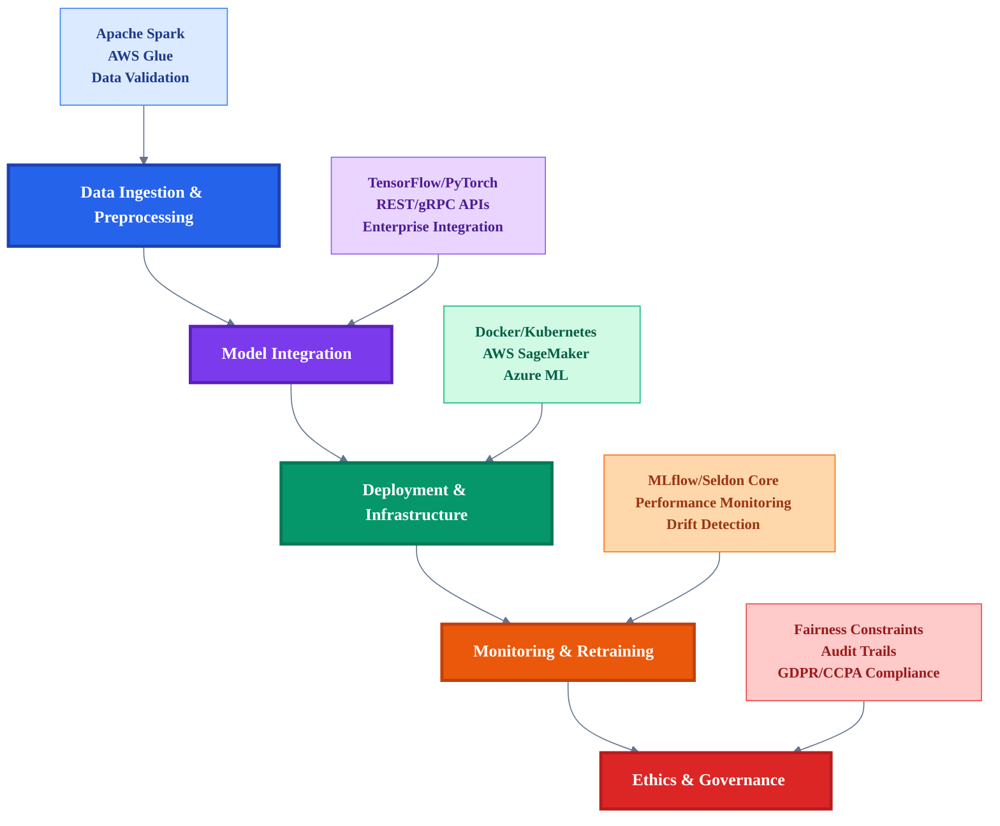
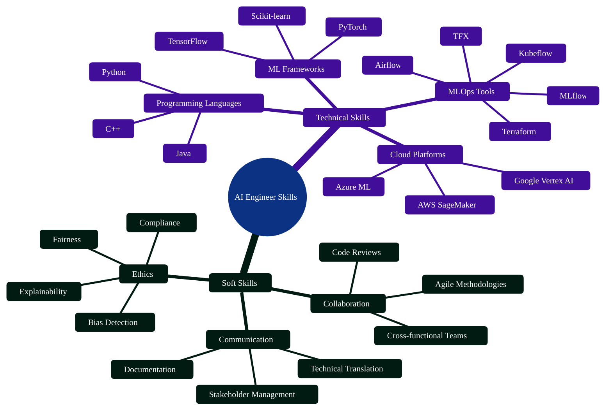
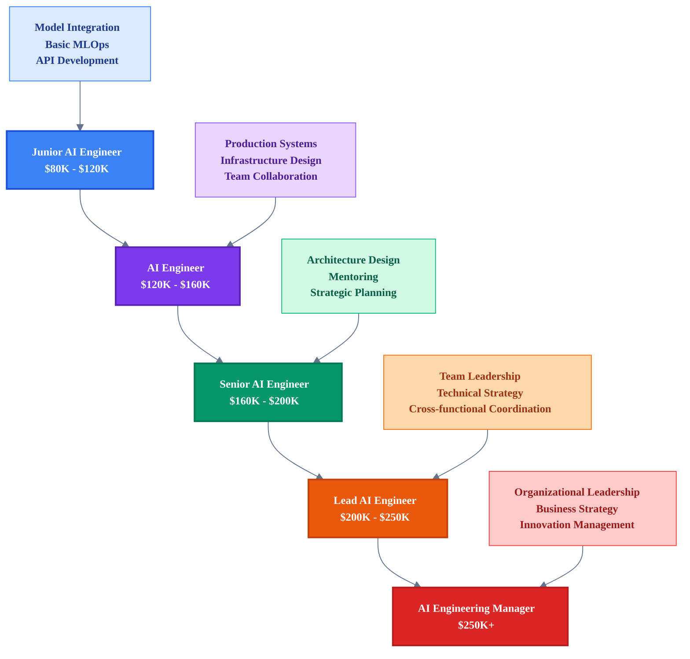
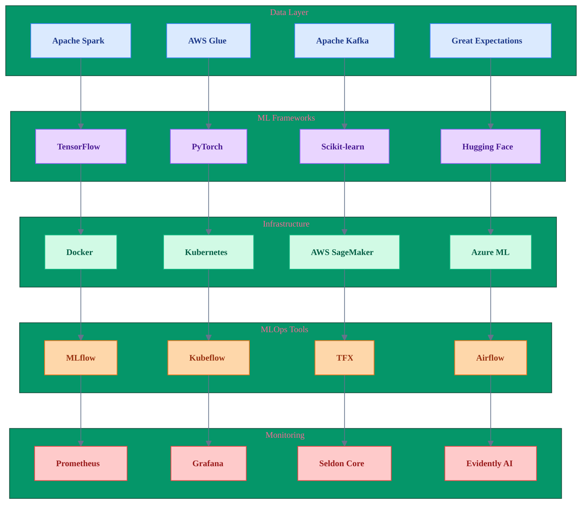

# The AI Engineer in the Enterprise: A LinkedIn Deep Dive

> **Navigation**: [🏠 Home](../../README.md) | [🔬 ML Engineer](ml-engineer.md) | [📊 Data Scientist](data-scientist.md) | [📊 Data Engineer](data-engineer.md) | [💻 AI Developer](ai-developer.md) | [🏗️ MLOps](../implementation/mlops-architecture.md) | [📋 Assessment](../assessment/skills-assessment.md)

## Abstract

The AI Engineer bridges cutting-edge AI research with practical business solutions. As artificial intelligence permeates business operations, the need for professionals who can operationalize models is at an all-time high. This role is essential for converting theoretical models into robust production systems, driving innovation, and ensuring ethical implementation of AI.

## Introduction

Organizations today are undergoing rapid digital transformations. AI is no longer experimental—it's a core business function. According to a 2024 report by LinkedIn, roles requiring AI implementation skills grew 55% year-over-year (LinkedIn Talent Insights 2024). AI Engineers serve as the linchpin between data science research and scalable production systems, translating machine learning advances into deployable, trustworthy applications.

---

## Role Definition & Evolution

The term "AI Engineer" became widely recognized around 2018, as companies began scaling AI projects beyond the proof-of-concept phase (Mobilunity Blog 2025). Unlike Machine Learning Engineers, who focus primarily on model design and training, or Data Scientists, who explore and interpret datasets, AI Engineers build the infrastructure that ensures models run reliably in production. They work across disciplines—integrating DevOps, data pipelines, APIs, and security—to support full lifecycle AI applications (Index.dev 2025).

---

## Core Responsibilities

1. **Data Ingestion & Preprocessing**: AI Engineers are responsible for developing automated pipelines using tools like Apache Spark or AWS Glue that transform raw data into clean, labeled formats suitable for training models (DataCamp 2024).
2. **Model Integration**: They integrate trained models (often built in TensorFlow or PyTorch) into production systems. This includes encapsulating inference logic within APIs (e.g., REST, gRPC) and ensuring interoperability with enterprise platforms (Upwork Resources 2025).
3. **Deployment & Infrastructure**: They use containerization (Docker) and orchestration platforms (Kubernetes, Amazon EKS) to deploy scalable, fault-tolerant inference services. Cloud platforms like AWS SageMaker or Azure ML streamline this process (Forbes 2025).
4. **Monitoring & Retraining**: Production AI systems require constant oversight. AI Engineers implement performance monitoring (latency, throughput, drift), retraining triggers, and rollback capabilities using tools like MLflow and Seldon Core (HBR 2024).
5. **Ethics & Governance**: With increasing scrutiny on algorithmic bias and compliance, AI Engineers embed fairness constraints, implement audit trails, and comply with frameworks such as GDPR and CCPA (Google Cloud Blog 2024).

---

## Visual: AI Engineer Workflow Overview

*Figure 1: AI Engineer workflow showing the sequential progression from data preparation to ethical governance, with supporting tools and technologies for each phase.*

---

## Visual: AI Engineer Skill Requirements

*Figure 2: Comprehensive skill requirements for AI Engineers, organized by technical and soft skills categories.*

---

## Visual: AI Engineer Career Progression

*Figure 3: Career progression path for AI Engineers showing salary ranges and key responsibilities at each level.*

---

## Visual: AI Engineer Technology Stack

*Figure 4: Technology stack for AI Engineers showing the layered architecture from data processing to monitoring and observability.*

---

## Skill Requirements

**Technical Skills**:

- Programming: Python (primary), Java (for systems integration), and C++ (for optimization-heavy components).
- ML Frameworks: TensorFlow, PyTorch, Scikit-learn.
- Cloud Platforms: AWS SageMaker, Azure ML, Google Vertex AI.
- MLOps Tools: Kubeflow, MLflow, TFX, Airflow, Terraform (infrastructure as code).

**Soft Skills**:

- Communication: Translating model limitations and capabilities for business teams.
- Collaboration: Working across product, data, and engineering teams.
- Ethics: Understanding the societal impact of AI and ensuring systems are unbiased and explainable (HBR 2024).

---

## Industry Demand & Market Trends

The Bureau of Labor Statistics predicts that employment in AI-related roles will grow by 22% through 2030 (BLS 2023). A 2025 LinkedIn Talent Insights survey places the median AI Engineer salary in the U.S. at \$160,000, with senior roles surpassing \$200,000. AI engineering roles are particularly concentrated in finance, healthcare, logistics, and e-commerce, where automation and real-time prediction provide substantial competitive advantages (LinkedIn Talent Insights 2025).

---

## Challenges & Best Practices

**Data Quality**: Poor data leads to flawed models. AI Engineers implement validation frameworks like Great Expectations or Deequ to detect anomalies before training (DataCamp 2024).

**Scalability**: Models may perform well locally but fail under real-world conditions. Engineers use horizontal scaling, asynchronous job queues, and batch inference strategies to meet demand (Forbes 2025).

**Model Drift**: AI systems degrade over time due to changing data distributions. Best practices include implementing drift detection (KL Divergence, PSI) and automated retraining loops (HBR 2024).

**Ethical Dilemmas**: Bias in models can result in discriminatory outcomes. Engineers mitigate this through debiasing techniques, explainability tools like SHAP/LIME, and fairness constraints in model objectives (Google Cloud Blog 2024).

---

## Case Studies

### 1. Google Cloud AI

In 2024, Google Cloud's translation team deployed quantized transformer models, reducing inference latency by 40% while maintaining BLEU score accuracy. AI Engineers led efforts in hardware-aware pruning and batch inference scheduling (Google Cloud Blog 2024).

### 2. AWS & Financial Services

A U.S.-based financial firm partnered with AWS to detect fraud in real time. AI Engineers built a streaming pipeline using Amazon Kinesis and SageMaker, resulting in a 30% drop in fraud cases within six months (AWS Case Studies 2023).

### 3. Retail Chatbot Automation

A leading e-commerce company implemented an AI chatbot trained on customer support transcripts. The solution, built by AI Engineers, handled 70% of Tier 1 requests, reducing agent load and boosting CSAT scores by 15% (Zendesk Case Studies 2024).

---

## Future Outlook

AI Engineers are entering an era defined by general-purpose agents, multimodal models (text + image + audio), and federated learning. Engineers will be critical in:

- Building edge-deployed models for IoT and mobile.
- Supporting long-context models for enterprise workflows.
- Enforcing AI transparency as new regulations (like the EU AI Act) take effect (HBR 2024).

As LLMs evolve into API-accessible agents and autonomous systems proliferate, the AI Engineer will play a central role in building guardrails and orchestrating components at scale.

---

## Conclusion

The AI Engineer has evolved from an infrastructural afterthought to a strategic enabler of AI value. They operationalize intelligence. As AI permeates every sector, those who can build and scale it responsibly will shape the future of work and business. Organizations that invest in AI engineering talent—and in the tools and culture that support them—will lead in the age of intelligence.

---

## Works Cited

Bureau of Labor Statistics. *Employment Projections*. U.S. Department of Labor, 2023.

DataCamp. "Essential Skills for AI Engineers." *DataCamp Blog*, 2024.

Forbes. "Why AI Engineers Are in High Demand." *Forbes*, 2025.

Google Cloud Blog. "Optimizing Translation Models with Pruning." *Google Cloud Blog*, 12 Nov. 2024, cloud.google.com/blog.

Harvard Business Review. "Governance in AI Deployments." *HBR*, 2024, hbr.org/2024/03/ai-governance.

LinkedIn Talent Insights. "AI Engineer Salary Report." *LinkedIn*, 2025, linkedin.com/talent/blog/ai-engineer-salary-report-2025.

Index.dev. "AI Engineer vs. ML Engineer: What's the Difference?" *Index.dev Blog*, 2025, index.dev/blog.

LinkedIn Talent Insights. "Emerging Roles Report." *LinkedIn*, 2024, linkedin.com/talent/blog.

Mobilunity. "AI Engineer Responsibilities and Scope." *Mobilunity Blog*, 2025, mobilunity.com/blog.

Upwork. "Understanding the AI Engineer Role." *Upwork Resources*, 2025, upwork.com/resources.

Zendesk. "E-commerce Chatbot Implementation." *Zendesk Case Studies*, 2024.

