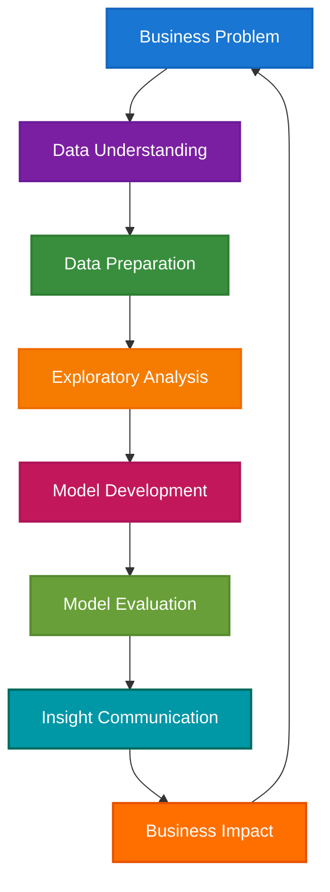

# The Data Scientist in the Enterprise: From Insights to Impact

> **Navigation**: [🏠 Home](../README.md) | [🔬 ML Engineer](ml-engineer.md) | [🤖 AI Engineer](ai-engineer.md) | [📊 Data Engineer](data-engineer.md) | [💻 AI Developer](ai-developer.md) | [🏗️ MLOps](../implementation/mlops-architecture.md) | [📋 Assessment](../assessment/skills-assessment.md)

---

## Abstract

Data Scientists are the analytical powerhouses of modern enterprises—transforming raw data into actionable insights that drive strategic decisions. They bridge the gap between business problems and data-driven solutions, combining statistical expertise with business acumen to unlock value from complex datasets. This guide explores the evolution, responsibilities, skills, and impact of Data Scientists in enterprise environments.

---

## Introduction

In today's data-driven economy, Data Scientists serve as the critical link between business objectives and analytical insights. While ML Engineers focus on production systems and Data Engineers build infrastructure, Data Scientists own the analytical lifecycle—from problem definition and data exploration to model development and business impact measurement. Their work directly influences strategic decisions across every industry sector.

---

## Role Definition & Evolution

**Data Scientists** are analytical experts who apply statistical methods, machine learning techniques, and business domain knowledge to extract meaningful insights from data. Unlike ML Engineers who focus on production deployment, Data Scientists concentrate on exploratory analysis, hypothesis testing, and translating complex findings into actionable business recommendations.

The role has evolved from traditional statisticians to require expertise in programming, machine learning, and business strategy, reflecting the increasing complexity of enterprise data challenges.

---

## Core Responsibilities

### 1. **Problem Definition & Business Understanding**
- Translating business challenges into analytical problems
- Defining success metrics and key performance indicators
- Understanding stakeholder requirements and constraints
- Aligning analytical approaches with business objectives

### 2. **Data Exploration & Analysis**
- Conducting exploratory data analysis (EDA) to understand data patterns
- Identifying data quality issues and anomalies
- Performing statistical analysis and hypothesis testing
- Creating visualizations to communicate findings

### 3. **Model Development & Validation**
- Building predictive and descriptive models using statistical and ML techniques
- Feature engineering and selection for model optimization
- Cross-validation and model performance evaluation
- Iterative model refinement based on business feedback

### 4. **Insight Communication & Storytelling**
- Translating complex analytical findings into business recommendations
- Creating compelling data visualizations and dashboards
- Presenting insights to technical and non-technical stakeholders
- Driving data-driven decision making across the organization

### 5. **Collaboration & Knowledge Sharing**
- Working with cross-functional teams to implement insights
- Mentoring junior analysts and data professionals
- Contributing to data strategy and governance initiatives
- Staying current with analytical methods and industry trends

---

## Visual: Data Scientist Workflow



*This workflow diagram illustrates the iterative nature of data science projects, from initial business problem understanding through to measurable business impact and continuous improvement.*

---

## Visual: Data Scientist Skill Matrix


*This skill matrix shows the progression of Data Scientist competencies, from foundational statistical analysis to advanced domain expertise and business impact.*

---

## Skill Requirements

### **Technical Skills**

**Programming Languages:**
- **Python** (primary): Pandas, NumPy, Scikit-learn, Matplotlib, Seaborn
- **R**: Statistical analysis, visualization, specialized packages
- **SQL**: Complex queries, data manipulation, database optimization
- **JavaScript**: Interactive visualizations (D3.js, Plotly)

**Statistical & Analytical Methods:**
- **Descriptive Statistics**: Central tendency, variability, distribution analysis
- **Inferential Statistics**: Hypothesis testing, confidence intervals, p-values
- **Regression Analysis**: Linear, logistic, polynomial, time series
- **Experimental Design**: A/B testing, randomized controlled trials
- **Multivariate Analysis**: Principal component analysis, factor analysis

**Machine Learning:**
- **Supervised Learning**: Classification, regression, ensemble methods
- **Unsupervised Learning**: Clustering, dimensionality reduction
- **Model Evaluation**: Cross-validation, ROC curves, confusion matrices
- **Feature Engineering**: Selection, transformation, creation

**Data Visualization:**
- **Static Visualizations**: Matplotlib, Seaborn, ggplot2
- **Interactive Dashboards**: Tableau, Power BI, Streamlit
- **Storytelling**: Narrative structure, audience adaptation
- **Design Principles**: Color theory, layout, accessibility

### **Soft Skills**

- **Business Acumen**: Understanding industry dynamics and business models
- **Communication**: Translating technical findings for diverse audiences
- **Critical Thinking**: Questioning assumptions and validating conclusions
- **Problem Solving**: Breaking down complex problems into manageable components
- **Collaboration**: Working effectively with cross-functional teams

---

## Industry Demand & Market Trends

Data Scientists remain among the most sought-after professionals in the tech industry, with demand growing steadily across all sectors. According to LinkedIn's 2024 Emerging Jobs Report, Data Scientist roles have seen consistent growth, with particular demand in healthcare, finance, and technology sectors.

### **Salary Trends**
- **Entry-level**: $85,000 - $120,000
- **Mid-level**: $120,000 - $160,000
- **Senior**: $160,000 - $220,000+
- **Principal/Lead**: $220,000 - $300,000+

### **High-Demand Sectors**
1. **Healthcare**: Patient outcomes, drug discovery, operational efficiency
2. **Finance**: Risk assessment, fraud detection, algorithmic trading
3. **E-commerce**: Customer behavior, recommendation systems, pricing optimization
4. **Technology**: Product analytics, user experience, performance optimization

---

## Challenges & Best Practices

### **Technical Challenges**

**Data Quality & Availability:**
- **Data Cleaning**: Handling missing values, outliers, and inconsistencies
- **Data Integration**: Combining data from multiple sources and formats
- **Data Governance**: Ensuring privacy, security, and compliance
- **Scalability**: Processing large datasets efficiently

**Model Interpretability:**
- **Explainable AI**: Making complex models understandable to stakeholders
- **Bias Detection**: Identifying and mitigating algorithmic bias
- **Validation**: Ensuring models generalize well to new data
- **Monitoring**: Tracking model performance over time

**Communication & Impact:**
- **Stakeholder Alignment**: Managing expectations and requirements
- **Storytelling**: Creating compelling narratives from data
- **Change Management**: Driving adoption of data-driven decisions
- **ROI Measurement**: Quantifying the business impact of insights

### **Operational Best Practices**

**Project Management:**
```yaml
# Example data science project structure
phases:
  - discovery: 2-3 weeks
  - analysis: 4-6 weeks
  - modeling: 3-4 weeks
  - communication: 1-2 weeks
  - implementation: ongoing
```

**Quality Assurance:**
- Peer review of analytical methods and code
- Documentation of assumptions and limitations
- Reproducible research practices
- Version control for code and data

---

## Case Studies

### **1. Netflix: Content Recommendation Optimization**

**Challenge**: Improve content recommendation accuracy to increase user engagement and retention.

**Solution**: Data Scientists analyzed viewing patterns, user preferences, and content metadata to develop sophisticated recommendation algorithms:
- **User Segmentation**: Identified distinct viewer personas and preferences
- **Content Clustering**: Grouped similar content based on features and user behavior
- **A/B Testing**: Validated recommendation improvements through controlled experiments
- **Impact Measurement**: Tracked engagement metrics and retention rates

**Results**: 20% increase in user engagement, 15% improvement in content discovery, and significant reduction in churn rate.

### **2. Spotify: Personalized Music Discovery**

**Challenge**: Help users discover new music that matches their preferences and listening habits.

**Solution**: Implemented a comprehensive data science approach:
- **Audio Analysis**: Extracted musical features from audio files
- **User Behavior Analysis**: Tracked listening patterns and preferences
- **Collaborative Filtering**: Leveraged similar user preferences
- **Real-time Optimization**: Continuously refined recommendations

**Results**: 40% increase in new artist discovery, 25% improvement in user satisfaction scores, and enhanced platform stickiness.

### **3. Airbnb: Dynamic Pricing Optimization**

**Challenge**: Help hosts optimize pricing to maximize revenue while maintaining competitive rates.

**Solution**: Developed a dynamic pricing model using multiple data sources:
- **Market Analysis**: Analyzed competitor pricing and demand patterns
- **Seasonal Modeling**: Captured temporal trends and events
- **Demand Forecasting**: Predicted booking probability at different price points
- **Host Segmentation**: Customized recommendations based on property type and location

**Results**: 10-15% average revenue increase for hosts, improved booking rates, and enhanced market efficiency.

---

## Future Outlook

### **Emerging Trends**

**1. Automated Machine Learning (AutoML)**
- Automated feature engineering and model selection
- Democratization of advanced analytics
- Focus on business interpretation over technical implementation
- Integration with business intelligence platforms

**2. Responsible AI & Ethics**
- Bias detection and mitigation frameworks
- Explainable AI and model interpretability
- Ethical guidelines for data science practices
- Regulatory compliance and governance

**3. Real-Time Analytics**
- Streaming data analysis and insights
- Real-time decision support systems
- Event-driven analytics architectures
- Edge computing for local data processing

**4. Multimodal Data Analysis**
- Text, image, audio, and video processing
- Cross-modal learning and fusion
- Natural language processing for business applications
- Computer vision for operational insights

### **Skill Evolution**

Future Data Scientists will need expertise in:
- **Advanced Analytics**: Causal inference, experimental design, optimization
- **Business Strategy**: Understanding competitive dynamics and market positioning
- **Data Engineering**: Working with modern data stacks and real-time pipelines
- **AI Ethics**: Ensuring responsible and fair use of data and algorithms

---

## Conclusion

Data Scientists play a pivotal role in transforming enterprises into data-driven organizations. Their unique combination of technical expertise, business acumen, and communication skills enables them to bridge the gap between raw data and strategic insights.

The role continues to evolve as organizations recognize the value of data-driven decision making. Successful Data Scientists must balance technical excellence with business impact, ensuring that their insights drive measurable value for their organizations.

As data becomes increasingly central to business strategy, Data Scientists will continue to be essential partners in driving innovation, optimization, and competitive advantage across all industries.

---

## Works Cited

1. LinkedIn. "2024 Emerging Jobs Report." *LinkedIn Talent Insights*, 2024.
2. Harvard Business Review. "The Data Science Revolution." *HBR*, 2024.
3. Forbes. "The Evolution of Data Science in Enterprise." *Forbes*, 2024.
4. Netflix TechBlog. "Recommendation Systems at Scale." *Netflix TechBlog*, 2023.
5. Spotify Engineering. "Music Recommendation at Spotify." *Spotify Engineering Blog*, 2024.
6. Airbnb Engineering. "Dynamic Pricing with Machine Learning." *Airbnb Engineering Blog*, 2024.
7. McKinsey. "The Business Value of Data Science." *McKinsey Insights*, 2024.
8. MIT Sloan. "Data Science Leadership in the Digital Age." *MIT Sloan Management Review*, 2024. 