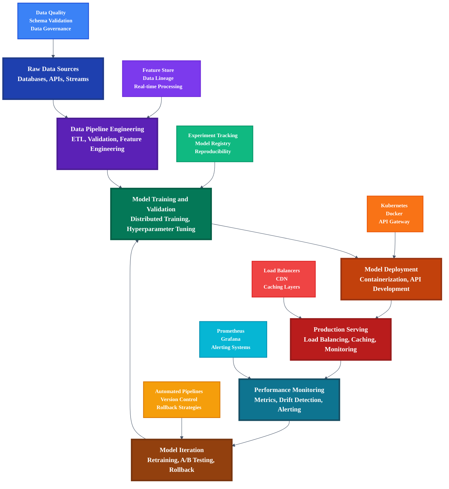
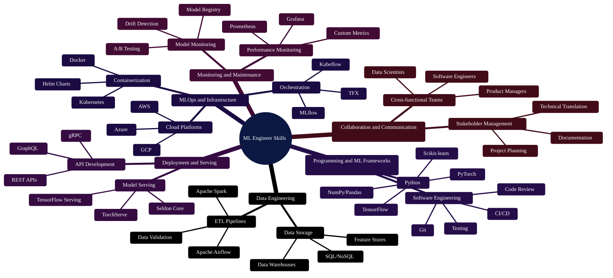
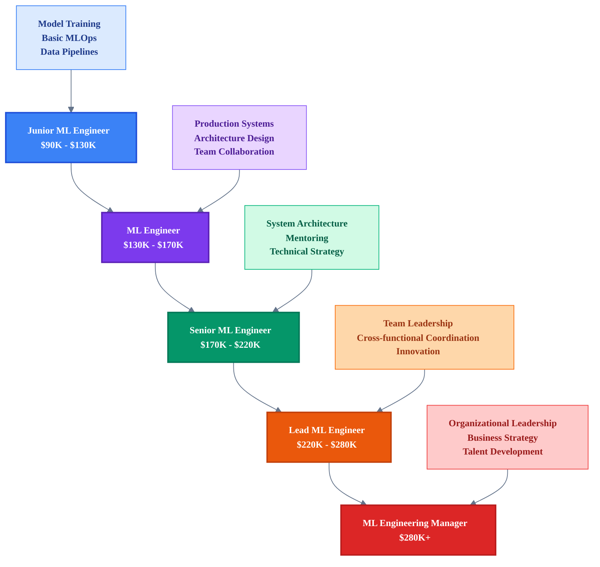
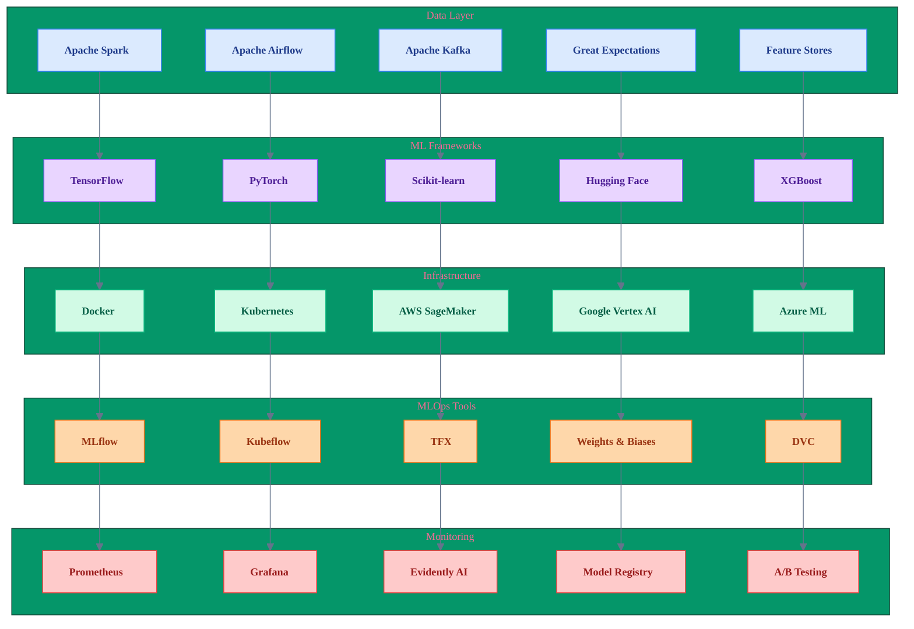
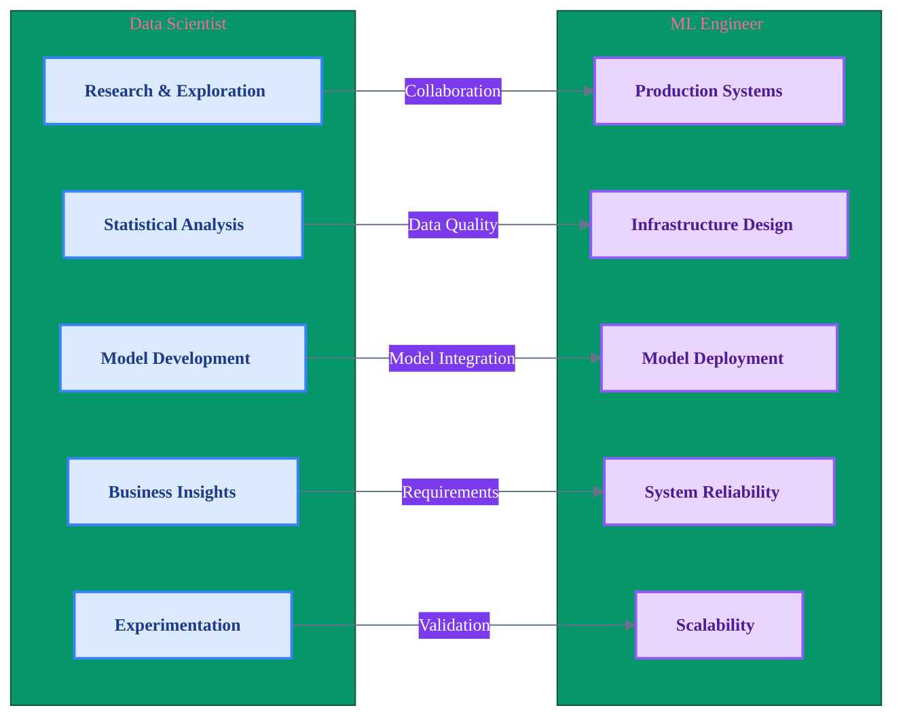

# The Machine Learning Engineer in the Enterprise: Bridging Models and Scale

> **Navigation**: [🏠 Home](../../README.md) | [📊 Data Scientist](data-scientist.md) | [🤖 AI Engineer](ai-engineer.md) | [📊 Data Engineer](data-engineer.md) | [💻 AI Developer](ai-developer.md) | [🏗️ MLOps](../implementation/mlops-architecture.md) | [📋 Assessment](../assessment/skills-assessment.md)

## Abstract

Machine Learning (ML) Engineers are the backbone of applied AI—turning raw models and ideas into scalable, robust systems. Their unique skillset bridges research and real-world impact, making them indispensable to any data-driven organization. This article explores the evolution, core responsibilities, required skills, challenges, and future directions of the ML Engineer role, with visuals and real-world examples.

---

## Introduction

While data scientists build and test models, ML Engineers turn those models into reliable, high-performance applications. In the last decade, demand for ML Engineers has exploded as companies invest in deploying machine learning at scale, integrating models into products, and maintaining them in ever-changing environments. The role has become increasingly critical as organizations move from experimental ML to production-ready AI systems that drive real business value.

---

## Role Definition & Evolution

**ML Engineers** are technical specialists responsible for developing, deploying, and maintaining machine learning models in production. Unlike data scientists—who focus on research, exploration, and experimentation—ML Engineers own the full machine learning lifecycle: from data pipelines and model training to deployment, monitoring, and iteration.

The role has evolved significantly from its origins in academic research to require strong software engineering, deep learning, and data architecture skills, reflecting the complexity of real-world AI systems. Modern ML Engineers must balance model performance with system reliability, scalability, and maintainability.

---

## Core Responsibilities

### 1. **Data Pipeline Engineering**
Designing and managing ETL pipelines that transform raw data into high-quality training datasets. This includes:
- Data validation and quality checks
- Feature engineering and transformation
- Real-time and batch processing workflows
- Data lineage tracking and governance

### 2. **Model Training & Validation**
Implementing and optimizing model training at scale, including:
- Distributed training across multiple GPUs/TPUs
- Hyperparameter optimization and tuning
- Cross-validation and model selection
- Experiment tracking and reproducibility

### 3. **Deployment & Serving**
Packaging models as scalable, low-latency services using:
- Container orchestration (Docker, Kubernetes)
- Serverless architectures (AWS Lambda, Google Cloud Functions)
- Microservice patterns for model serving
- API design and versioning strategies

### 4. **Monitoring & Maintenance**
Tracking model performance and system health:
- Real-time performance monitoring
- Data and concept drift detection
- Automated retraining pipelines
- Model versioning and rollback strategies

### 5. **Collaboration & Communication**
Partnering across teams to align ML with business objectives:
- Translating business requirements into technical specifications
- Coordinating with data scientists, software engineers, and product teams
- Ensuring model explainability and compliance
- Managing stakeholder expectations and timelines

---

## Visual: ML Engineer Lifecycle

*Figure 1: ML Engineer lifecycle showing the iterative, end-to-end process from raw data ingestion to continuous model improvement in production environments.*

---

## Visual: ML Engineer Skills Matrix

*Figure 2: Comprehensive skills matrix for ML Engineers organized by core competency areas.*

---

## Visual: ML Engineer Career Progression

*Figure 3: Career progression path for ML Engineers showing salary ranges and key responsibilities at each level.*

---

## Visual: ML Engineer Technology Stack

*Figure 4: Technology stack for ML Engineers showing the comprehensive toolset across data processing, ML frameworks, infrastructure, MLOps, and monitoring.*

---

## Visual: ML Engineer vs Data Scientist Comparison

*Figure 5: Comparison between Data Scientist and ML Engineer roles showing their distinct focus areas and collaboration points.*
