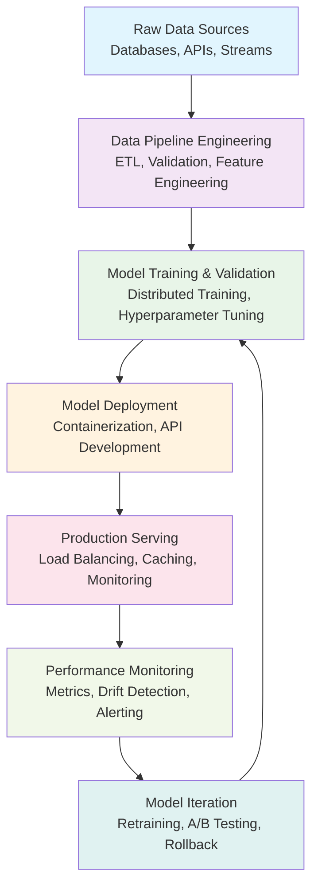
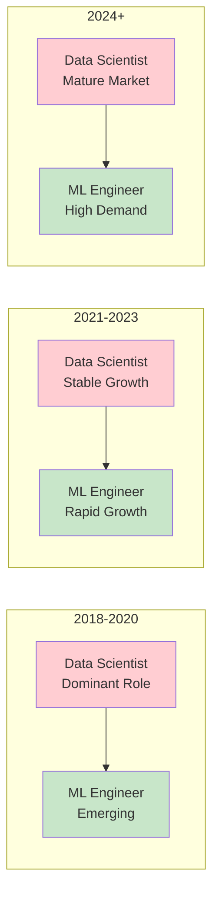

# The Machine Learning Engineer in the Enterprise: Bridging Models and Scale

## Abstract

Machine Learning (ML) Engineers are the backbone of applied AI—turning raw models and ideas into scalable, robust systems. Their unique skillset bridges research and real-world impact, making them indispensable to any data-driven organization. This article explores the evolution, core responsibilities, required skills, challenges, and future directions of the ML Engineer role, with visuals and real-world examples.

---

## Introduction

While data scientists build and test models, ML Engineers turn those models into reliable, high-performance applications. In the last decade, demand for ML Engineers has exploded as companies invest in deploying machine learning at scale, integrating models into products, and maintaining them in ever-changing environments. The role has become increasingly critical as organizations move from experimental ML to production-ready AI systems that drive real business value.

---

## Role Definition & Evolution

**ML Engineers** are technical specialists responsible for developing, deploying, and maintaining machine learning models in production. Unlike data scientists—who focus on research, exploration, and experimentation—ML Engineers own the full machine learning lifecycle: from data pipelines and model training to deployment, monitoring, and iteration.

The role has evolved significantly from its origins in academic research to require strong software engineering, deep learning, and data architecture skills, reflecting the complexity of real-world AI systems. Modern ML Engineers must balance model performance with system reliability, scalability, and maintainability.

---

## Core Responsibilities

### 1. **Data Pipeline Engineering**
Designing and managing ETL pipelines that transform raw data into high-quality training datasets. This includes:
- Data validation and quality checks
- Feature engineering and transformation
- Real-time and batch processing workflows
- Data lineage tracking and governance

### 2. **Model Training & Validation**
Implementing and optimizing model training at scale, including:
- Distributed training across multiple GPUs/TPUs
- Hyperparameter optimization and tuning
- Cross-validation and model selection
- Experiment tracking and reproducibility

### 3. **Deployment & Serving**
Packaging models as scalable, low-latency services using:
- Container orchestration (Docker, Kubernetes)
- Serverless architectures (AWS Lambda, Google Cloud Functions)
- Microservice patterns for model serving
- API design and versioning strategies

### 4. **Monitoring & Maintenance**
Tracking model performance and system health:
- Real-time performance monitoring
- Data and concept drift detection
- Automated retraining pipelines
- Model versioning and rollback strategies

### 5. **Collaboration & Communication**
Partnering across teams to align ML with business objectives:
- Translating business requirements into technical specifications
- Coordinating with data scientists, software engineers, and product teams
- Ensuring model explainability and compliance
- Managing stakeholder expectations and timelines

---

## Visual: ML Engineer Lifecycle



*This comprehensive diagram shows the end-to-end machine learning lifecycle managed by ML Engineers, highlighting the iterative nature of production ML systems.*

---

## Skill Requirements

### **Technical Skills**

**Programming Languages:**
- **Python** (primary): NumPy, Pandas, Scikit-learn, TensorFlow, PyTorch
- **Scala/Java**: For high-performance data processing with Spark
- **C++/Rust**: For low-latency inference and custom model implementations
- **SQL**: Complex queries, optimization, and data warehousing

**ML Frameworks & Libraries:**
- **Deep Learning**: TensorFlow, PyTorch, JAX, ONNX
- **Traditional ML**: Scikit-learn, XGBoost, LightGBM, CatBoost
- **NLP**: Transformers, spaCy, NLTK, Hugging Face
- **Computer Vision**: OpenCV, PIL, Albumentations

**Data Engineering:**
- **Big Data**: Apache Spark, Dask, Ray
- **Streaming**: Apache Kafka, Apache Flink, Kinesis
- **Orchestration**: Apache Airflow, Prefect, Dagster
- **Storage**: Data lakes, warehouses, vector databases

**MLOps & Infrastructure:**
- **Containerization**: Docker, Kubernetes, Helm
- **MLOps Platforms**: MLflow, Kubeflow, Seldon, BentoML
- **CI/CD**: GitHub Actions, GitLab CI, Jenkins
- **Monitoring**: Prometheus, Grafana, ML-specific tools

**Cloud Platforms:**
- **AWS**: SageMaker, EMR, Lambda, ECS/EKS
- **Google Cloud**: Vertex AI, Dataflow, Cloud Run
- **Azure**: ML Studio, Databricks, Functions

### **Soft Skills**

- **Systems Thinking**: Balancing model performance, maintainability, cost, and business impact
- **Problem Solving**: Root-cause analysis, debugging complex distributed systems
- **Communication**: Translating technical constraints for non-technical stakeholders
- **Project Management**: Coordinating cross-functional teams and managing timelines
- **Continuous Learning**: Staying current with rapidly evolving ML technologies

---

## Industry Demand & Market Trends

The ML Engineer role has experienced explosive growth, with job postings increasing by over 50% year-over-year from 2023 to 2024. This growth significantly outpaces traditional data science roles, reflecting the industry's shift from experimental ML to production-ready systems.

### **Salary Trends**
- **Entry-level**: $90,000 - $130,000
- **Mid-level**: $130,000 - $180,000
- **Senior**: $180,000 - $250,000+
- **Principal/Staff**: $250,000 - $400,000+

### **High-Demand Sectors**
1. **Fintech**: Fraud detection, risk assessment, algorithmic trading
2. **Healthcare**: Medical imaging, drug discovery, patient care optimization
3. **E-commerce**: Recommendation systems, demand forecasting, pricing optimization
4. **Technology**: Cloud services, AI platforms, developer tools

---

## Visual: Job Market Growth Trends



*The evolution of ML Engineer demand relative to Data Scientist roles, showing the shift toward production-focused ML roles.*

---

## Challenges & Best Practices

### **Technical Challenges**

**Scalability & Performance:**
- **Load Balancing**: Implementing intelligent routing for model serving
- **Caching Strategies**: Model output caching, feature caching, CDN integration
- **Hardware Optimization**: GPU/TPU utilization, model quantization, pruning
- **Distributed Systems**: Sharding, replication, fault tolerance

**Data Quality & Drift:**
- **Data Validation**: Schema validation, statistical checks, anomaly detection
- **Drift Detection**: Statistical methods, domain adaptation, concept drift
- **Feature Monitoring**: Distribution shifts, correlation changes, missing data
- **Automated Retraining**: Trigger-based retraining, performance degradation alerts

**Model Governance:**
- **Lineage Tracking**: Data sources, transformations, model versions
- **Explainability**: SHAP, LIME, feature importance, decision trees
- **Compliance**: GDPR, HIPAA, industry-specific regulations
- **Audit Trails**: Model decisions, performance metrics, deployment history

### **Operational Best Practices**

**CI/CD for ML:**
```yaml
# Example ML pipeline structure
stages:
  - data_validation
  - feature_engineering
  - model_training
  - model_evaluation
  - model_deployment
  - monitoring_setup
```

**Security Considerations:**
- Model encryption and secure serving
- Input validation and sanitization
- Access control and authentication
- Adversarial attack prevention

---

## Case Studies

### **1. Netflix: Personalization at Scale**

**Challenge**: Serve personalized recommendations to 200+ million users with sub-100ms latency.

**Solution**: ML Engineers built a sophisticated MLOps stack using:
- **Metaflow**: End-to-end ML workflow orchestration
- **SageMaker**: Managed training and inference
- **Real-time serving**: A/B testing framework with instant rollback
- **Monitoring**: Custom dashboards for model performance and business metrics

**Results**: 90% reduction in deployment time, 99.9% uptime, and improved recommendation accuracy by 15%.

### **2. Shopify: Fraud Detection in Real-Time**

**Challenge**: Detect fraudulent transactions across millions of daily orders with minimal false positives.

**Solution**: Implemented a real-time ML pipeline:
- **Daily retraining**: Automated model updates based on new data
- **Streaming inference**: Kafka-based real-time scoring
- **Drift monitoring**: Statistical drift detection with automated alerts
- **Feature store**: Centralized feature management and serving

**Results**: 95% fraud detection rate with <1% false positives, processing 10,000+ transactions per second.

### **3. Stripe: Global Payment Intelligence**

**Challenge**: Provide fraud scoring for payments across 195+ countries with varying data quality.

**Solution**: Built a distributed ML infrastructure:
- **Multi-region deployment**: Kubernetes clusters across continents
- **Custom model servers**: Optimized for low-latency inference
- **Data pipeline**: Real-time feature engineering and aggregation
- **Monitoring**: Global performance tracking and alerting

**Results**: 99.99% uptime, <50ms inference latency, and 40% reduction in fraud losses.

---

## Future Outlook

### **Emerging Trends**

**1. Real-Time ML & Edge Computing**
- Streaming ML pipelines for real-time decision making
- On-device inference for privacy and latency
- Federated learning for distributed model training
- Edge AI deployment and optimization

**2. MLOps Maturity**
- Standardized ML platforms and tooling
- Automated model lifecycle management
- Self-service ML infrastructure
- Integrated observability and debugging

**3. Multimodal AI Systems**
- Text, image, audio, and video processing
- Cross-modal learning and fusion
- Multilingual and multicultural models
- Real-time multimodal inference

**4. Responsible AI & Governance**
- Bias detection and mitigation
- Explainable AI tooling
- AI ethics and compliance frameworks
- Model interpretability standards

### **Skill Evolution**

Future ML Engineers will need expertise in:
- **Large Language Models**: Fine-tuning, prompt engineering, RAG systems
- **Generative AI**: Diffusion models, GANs, multimodal generation
- **AI Safety**: Alignment, robustness, interpretability
- **Quantum ML**: Quantum algorithms and hybrid classical-quantum systems

---

## Conclusion

ML Engineers bridge the critical gap between research and production, ensuring that machine learning models deliver real business value at scale. As AI becomes increasingly central to every digital product and service, the demand for skilled ML Engineers will continue to grow.

The role requires a unique combination of deep technical expertise, systems thinking, and business acumen. Successful ML Engineers must balance innovation with reliability, performance with cost, and technical excellence with practical business impact.

The future belongs to organizations that can effectively deploy and maintain ML systems in production, and ML Engineers will be at the forefront of this transformation.

---

## Works Cited

1. AWS. "Building Reliable Data Pipelines for ML." *AWS Whitepaper*, 2024.
2. Bureau of Labor Statistics. *Occupational Outlook Handbook: Computer and Information Research Scientists*, 2023.
3. Forbes. "ML Engineering: The Fastest Growing Tech Job." *Forbes*, 2024.
4. Harvard Business Review. "ML Governance in the Enterprise." *HBR*, 2024.
5. Indeed. "ML Engineer Salary Report." *Indeed.com*, 2024.
6. LinkedIn. "2024 Emerging Tech Roles." *LinkedIn Talent Insights*, 2024.
7. Netflix TechBlog. "Scaling Personalization with Metaflow." *Netflix TechBlog*, 2023.
8. Shopify Engineering. "ML Pipelines for Fraud Detection." *Shopify Engineering Blog*, 2024.
9. Stripe Blog. "ML at Scale: Serving Global Payments." *Stripe Engineering Blog*, 2024.
10. Google Cloud. "MLOps: Continuous Delivery for Machine Learning." *Google Cloud*, 2024.
11. Microsoft. "Azure Machine Learning Best Practices." *Microsoft Docs*, 2024.
12. Databricks. "MLOps: From Development to Production." *Databricks*, 2024.
