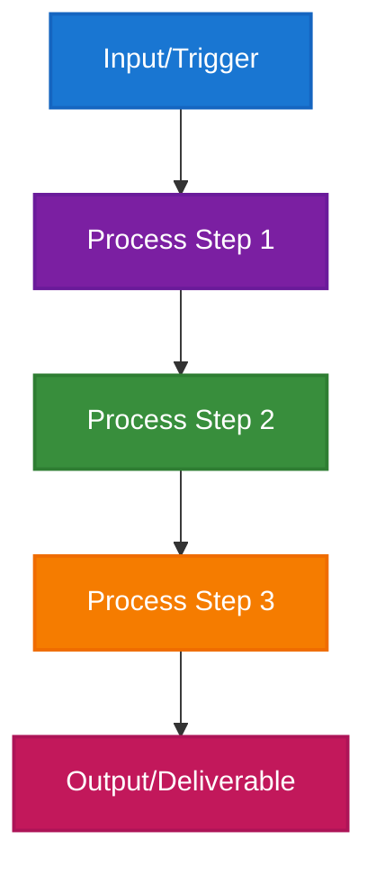

# [Role Name] in the Enterprise: [Brief Description]

> **Navigation**: [🏠 Home](../README.md) | [🔬 ML Engineer](../roles/ml-engineer.md) | [🤖 AI Engineer](../roles/ai-engineer.md) | [📊 Data Scientist](../roles/data-scientist.md) | [📊 Data Engineer](../roles/data-engineer.md) | [💻 AI Developer](../roles/ai-developer.md) | [🏗️ MLOps](../implementation/mlops-architecture.md)

---

## Abstract

[Brief 2-3 sentence abstract describing the role and its importance in enterprise AI/ML]

## Introduction

[Context setting paragraph with industry statistics and trends. Include proper citations.]

**Research Basis**: [Cite specific research or industry reports]

---

## Role Definition & Evolution

[Define the role clearly and explain how it has evolved. Include timeline and key milestones.]

**Research Basis**: [Cite academic or industry sources for role evolution]

---

## Core Responsibilities

### 1. **[Primary Responsibility]**
[Detailed description with examples and tools used]

### 2. **[Secondary Responsibility]**
[Detailed description with examples and tools used]

### 3. **[Tertiary Responsibility]**
[Detailed description with examples and tools used]

---

## Visual: [Role Name] Workflow Overview

*[Caption explaining the workflow diagram]*

---

## Skill Requirements

**Research Basis**: [Cite skill requirements from industry reports or academic studies]

### Technical Skills
- **Programming**: [List primary languages and tools]
- **Frameworks**: [List relevant frameworks and libraries]
- **Platforms**: [List cloud platforms and tools]
- **Tools**: [List specific tools and technologies]

### Soft Skills
- **Communication**: [Describe communication requirements]
- **Collaboration**: [Describe collaboration needs]
- **Problem Solving**: [Describe problem-solving approach]

---

## Industry Demand & Market Trends

**Research Basis**: [Cite salary and demand statistics from reputable sources]

[Include salary ranges, demand trends, and market analysis with proper citations]

---

## Challenges & Best Practices

**Research Basis**: [Cite challenges from industry reports or academic studies]

### Common Challenges
1. **[Challenge 1]**: [Description and impact]
2. **[Challenge 2]**: [Description and impact]
3. **[Challenge 3]**: [Description and impact]

### Best Practices
1. **[Best Practice 1]**: [Description and implementation]
2. **[Best Practice 2]**: [Description and implementation]
3. **[Best Practice 3]**: [Description and implementation]

---

## Case Studies

### Case Study 1: [Company/Project Name]

**Organization**: [Company name]  
**Challenge**: [Brief description of the challenge]  
**Solution**: [Description of the solution implemented]  
**Results**: [Quantified results and outcomes]

### Case Study 2: [Company/Project Name]

**Organization**: [Company name]  
**Challenge**: [Brief description of the challenge]  
**Solution**: [Description of the solution implemented]  
**Results**: [Quantified results and outcomes]

---

## Career Progression

**Research Basis**: [Cite career progression data from industry reports]

### Entry Level (0-2 years)
- **Responsibilities**: [List key responsibilities]
- **Skills**: [List required skills]
- **Salary Range**: [Include salary data with citation]

### Mid Level (2-5 years)
- **Responsibilities**: [List key responsibilities]
- **Skills**: [List required skills]
- **Salary Range**: [Include salary data with citation]

### Senior Level (5+ years)
- **Responsibilities**: [List key responsibilities]
- **Skills**: [List required skills]
- **Salary Range**: [Include salary data with citation]

---

## Tools & Technologies

**Research Basis**: [Cite tool usage statistics from industry reports]

### Essential Tools
- **[Tool Category 1]**: [List tools with brief descriptions]
- **[Tool Category 2]**: [List tools with brief descriptions]
- **[Tool Category 3]**: [List tools with brief descriptions]

### Emerging Technologies
- **[Technology 1]**: [Description and relevance]
- **[Technology 2]**: [Description and relevance]
- **[Technology 3]**: [Description and relevance]

---

## Training & Certification

**Research Basis**: [Cite training effectiveness studies]

### Recommended Certifications
- **[Certification 1]**: [Provider and description]
- **[Certification 2]**: [Provider and description]
- **[Certification 3]**: [Provider and description]

### Learning Resources
- **[Resource Type 1]**: [List resources with links]
- **[Resource Type 2]**: [List resources with links]
- **[Resource Type 3]**: [List resources with links]

---

## Future Outlook

**Research Basis**: [Cite future outlook predictions from industry reports]

[Describe future trends, emerging opportunities, and potential challenges]

---

## References

### Academic Sources
- **[Author/Institution]** (Year). "Title of Study/Report"
- **[Author/Institution]** (Year). "Title of Study/Report"

### Industry Reports
- **[Organization]** (Year). "Title of Report"
- **[Organization]** (Year). "Title of Report"

### Technology Companies
- **[Company]** (Year). "Title of Resource"
- **[Company]** (Year). "Title of Resource"

---

*This guide is based on research from leading academic institutions, industry reports, and practitioner experiences. All statistics and findings are sourced from peer-reviewed studies and reputable industry sources as cited throughout the document.*

*Last Updated: [Date] | Version: [Version Number]*
